# IDMClone

Trình quản lý tải xuống đa luồng cho Windows, tính năng hướng theo Internet Download Manager.

**Trạng thái: P0 → P7 hoàn thành** — engine lõi, giao diện đồ hoạ, tích hợp
trình duyệt, tải video streaming, hàng đợi/hẹn giờ, Site Grabber, bản đóng gói
cho Windows, và bản nâng cấp giao diện kèm bắt link clipboard / thêm hàng loạt /
lịch sử / checksum / hộp thả nổi. Lộ trình đầy đủ ở [docs/PLAN.md](docs/PLAN.md).

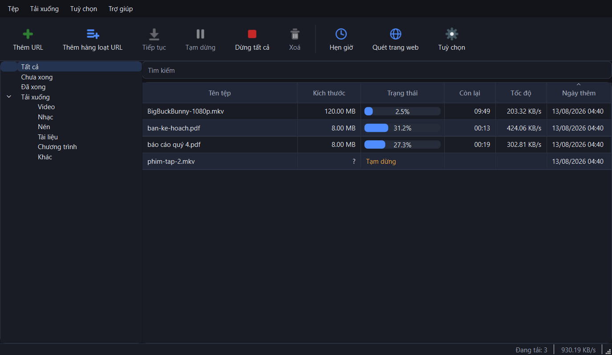

## Cài đặt

Người dùng cuối: chạy `IDMCloneSetup-0.2.0.exe` (xem mục [Đóng gói](#đóng-gói)
để tự dựng). Bản cài đặt đã kèm sẵn Python và Qt nên máy sạch không cần cài gì
thêm.

Lập trình viên:

```bash
python -m venv .venv && .venv/Scripts/python -m pip install -e ".[dev]"
```

Phần tải video cần thêm `ffmpeg` trong PATH (hoặc chỉ đường dẫn trong
**Tuỳ chọn → Video**). Thiếu ffmpeg thì app vẫn tải xong, chỉ là để nguyên
`.ts` và không ghép được video với âm thanh.

## Chạy giao diện

```bash
.venv/Scripts/python -m app
```

Cửa sổ chính có thanh công cụ, cây danh mục, bảng tiến độ, khay hệ thống, kéo-thả
link và menu chuột phải. Nhấn `Ctrl+N` để thêm URL, `Ctrl+Shift+N` để thêm hàng
loạt, `Ctrl+V` để dán link từ clipboard, nhấp đúp vào dòng đang tải để mở cửa sổ
tiến độ (biểu đồ tốc độ + bản đồ các đoạn), nhấp đúp vào dòng đã xong để mở tệp.
Hai nút **Hẹn giờ** và **Quét trang web** mở phần hàng đợi và Site Grabber ở dưới.

| | |
|---|---|
| 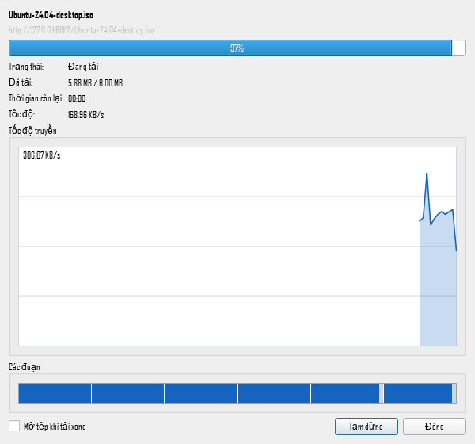 | 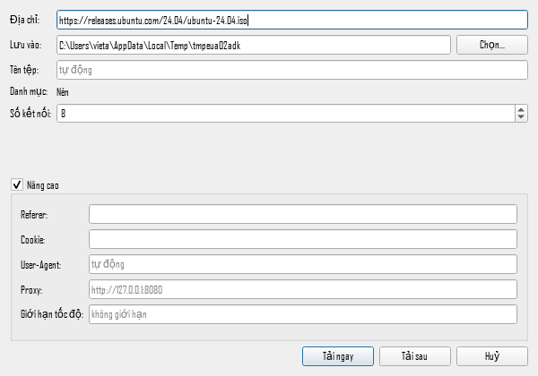 |
| 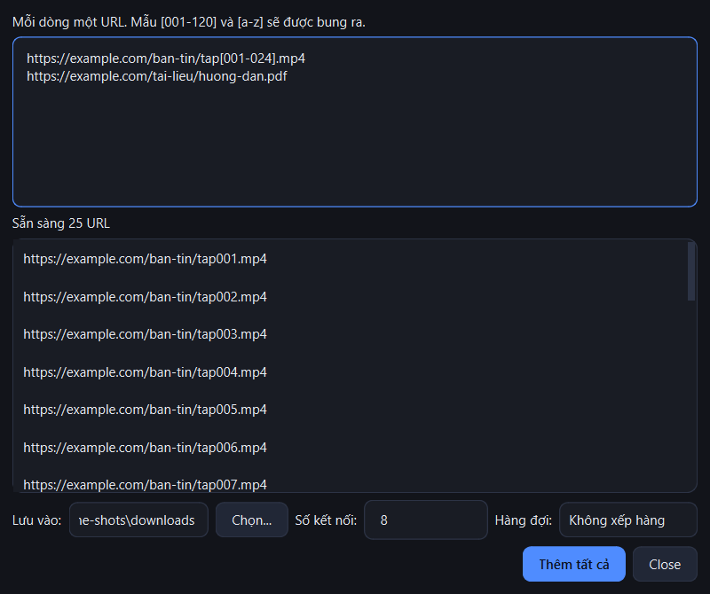 | 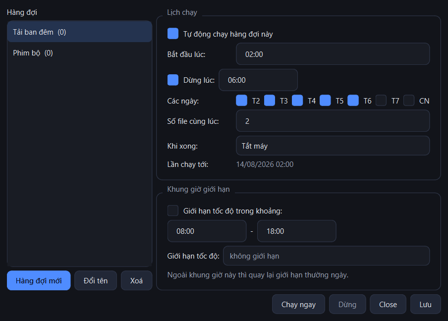 |

### Bảy bộ giao diện

**Tuỳ chọn → Giao diện** chọn một trong bảy, hoặc để **Theo Windows** cho nó tự
đổi sáng/tối theo hệ thống. Đổi là thấy ngay, không cần khởi động lại — kể cả
icon cũng được vẽ lại theo màu mới.

| | | |
|---|---|---|
| 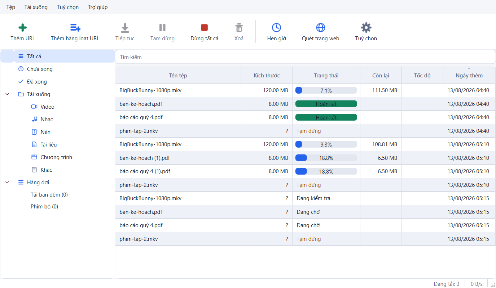<br>**Sáng** | 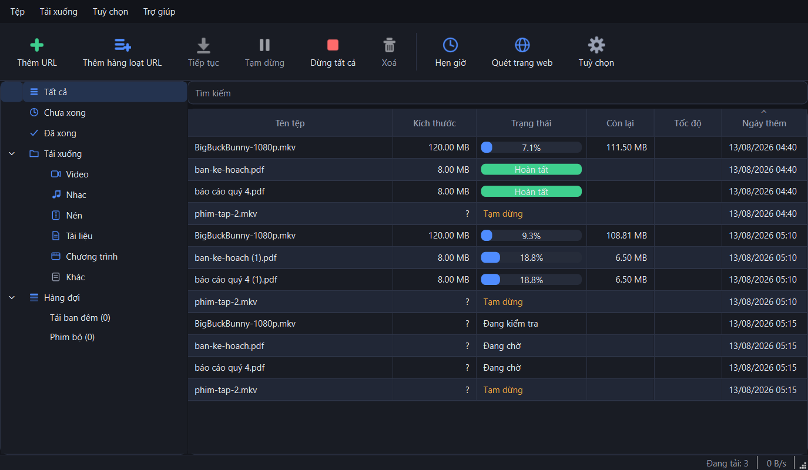<br>**Tối** | 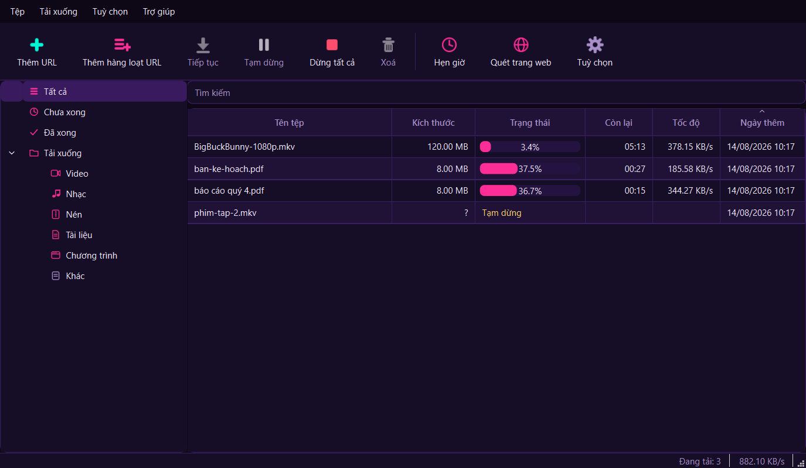<br>**Cyberpunk** |
| 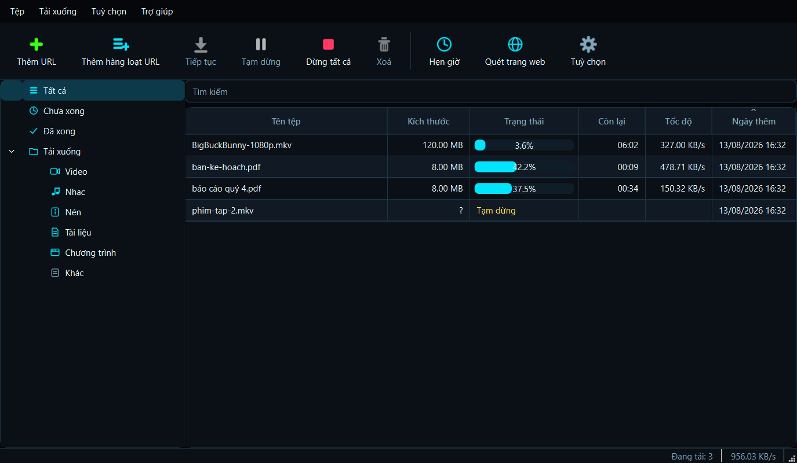<br>**Neon** | 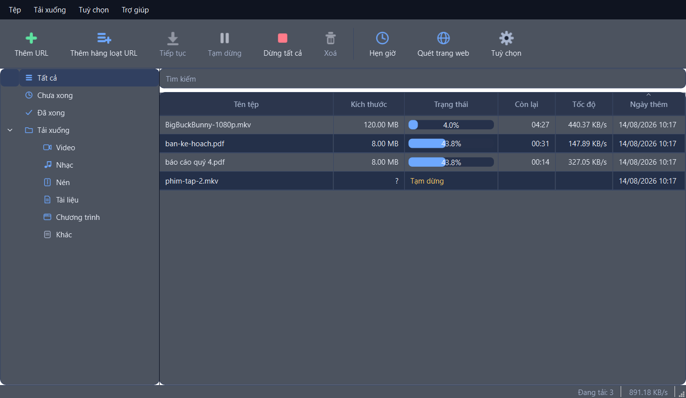<br>**Kính mờ** | 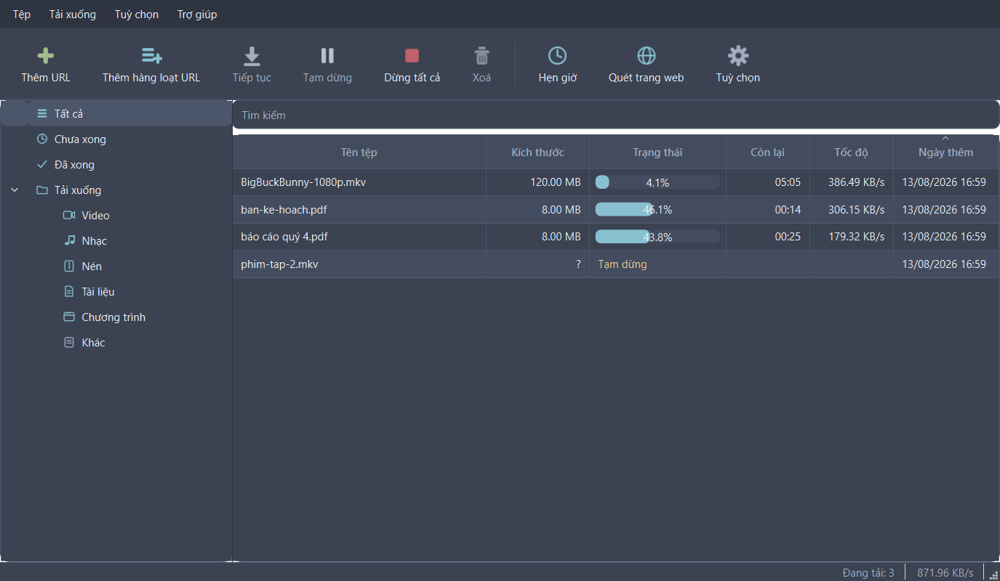<br>**Nord** |
| 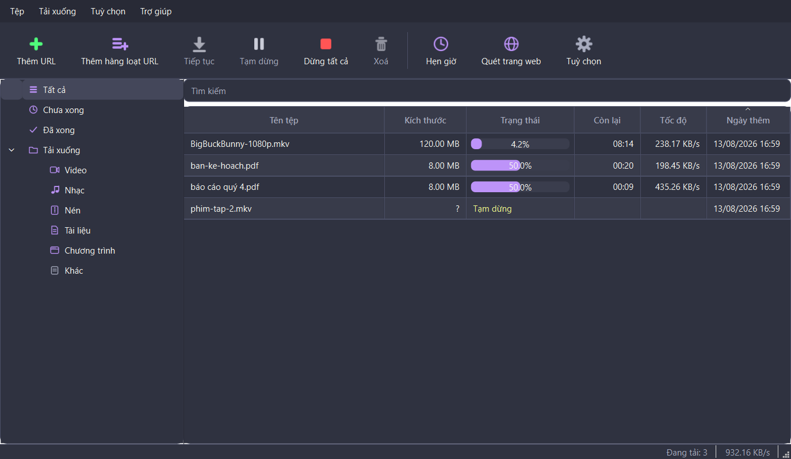<br>**Dracula** | | |

Vài điểm về cách làm:

- Mỗi theme là **một bộ token màu**, không phải một file CSS riêng — cùng một
  stylesheet sinh ra cho cả bảy, nên thêm theme mới chỉ là thêm mười bốn màu.
- Có test kiểm **độ tương phản**: chữ trên nền của *mọi* theme phải đạt tối
  thiểu 4.5:1 (mức AA của WCAG), nên không theme nào đẹp mà khó đọc.
- **Kính mờ** dùng nền trong suốt thật: app xin Windows 11 dựng lớp *acrylic*
  qua `DwmSetWindowAttribute`. Máy Windows 10 hoặc bản 11 cũ thì lời gọi đó
  trượt vô hại và theme lùi về dạng panel mờ, không có blur.
- Icon được **vẽ bằng QPainter theo màu của theme**: nút Thêm lấy màu success,
  Tạm dừng lấy warning, Dừng/Xoá lấy danger. Cyberpunk ra hồng tím, Neon ra
  xanh cyan, không cần bộ icon riêng cho từng theme.

Ảnh chụp trong tài liệu sinh lại được bằng:

```bash
.venv/Scripts/python scripts/make_screenshots.py --theme dark
.venv/Scripts/python scripts/make_screenshots.py --gallery   # bảng bảy theme ở trên
```

## Tích hợp Chrome / Edge

Ba bước, làm theo đúng thứ tự vì bước 3 cần ID sinh ra ở bước 2:

1. Chạy app một lần để nó tạo socket IPC: `python -m app`
2. Mở `chrome://extensions` (hoặc `edge://extensions`) → bật **Developer mode** →
   **Load unpacked** → chọn thư mục [extension/](extension/). Copy **ID** hiện ra
   dưới tên extension (32 chữ cái).
3. Đăng ký native messaging host cho ID đó — ba cách, chọn một:

```bash
.venv/Scripts/python -m app.ipc.register --install <extension-id>   # từ mã nguồn
idmclone-cli.exe --register-host <extension-id>                     # bản đóng gói
```

hoặc mở **Tuỳ chọn → Tích hợp trình duyệt**, dán ID vào rồi bấm *Đăng ký* — cách
này không cần dòng lệnh và cũng cho biết trình duyệt nào đã nhận.

Kiểm tra: `--host-status`. Gỡ: `--unregister-host`.

Sau đó bấm một link tải bất kỳ trong trình duyệt — extension huỷ download của
Chrome và chuyển URL **kèm cookie, referer và User-Agent** sang app (thiếu cookie
thì file cần đăng nhập sẽ tải về thành trang login). Nút nổi "Tải video này" xuất
hiện khi trang có media: link `.m3u8`/`.mpd` đi thẳng vào pipeline video, còn với
YouTube/Vimeo/TikTok... extension gửi **URL của trang** để app hỏi yt-dlp (URL
segment của mấy site này có chữ ký, sniff về cũng vô dụng).

Nếu app chưa chạy, native host tự khởi động nó rồi mới chuyển link. Chạy
`python -m app <url>` khi app đang mở thì URL được đẩy vào cửa sổ có sẵn thay vì
mở cửa sổ thứ hai.

Cách hoạt động:

```
Chrome extension ──native messaging (4-byte length + JSON trên stdio)──> native_host.bat
                                                                              │
        app/ipc/endpoint.py  <──JSON theo dòng, TCP 127.0.0.1 + token──────────┘
                    │
              IpcBridge (queued signal) ──> MainWindow.handle_ipc_download
```

Token nằm trong `%LOCALAPPDATA%\IDMClone\ipc.json`; mọi tin nhắn không có token
đúng đều bị từ chối, nên tiến trình của người dùng khác trên cùng máy không điều
khiển được app dù cổng loopback về mặt kỹ thuật vẫn kết nối được.

## Dùng bằng dòng lệnh

```bash
.venv/Scripts/python -m app "https://example.com/file.zip" -o D:\Downloads -n 16
```

Các tuỳ chọn hay dùng:

| Cờ | Ý nghĩa |
|---|---|
| `-n 16` | 16 segment cho mỗi file (1–32, mặc định 8) |
| `-j 3` | số file tải song song |
| `-l 2M` | giới hạn tốc độ tổng (`500k`, `1.5M`, ...) |
| `--categories` | tự xếp file vào `Video/`, `Music/`, `Compressed/`, ... |
| `--cookie`, `--referer`, `--user-agent`, `-H "K: V"` | tải file cần đăng nhập |
| `--proxy http://127.0.0.1:8080` | đi qua proxy |
| `--video`, `--quality 1080`, `--audio-only`, `--list-formats` | phần video, xem mục dưới |

Nhấn `Ctrl+C` để tạm dừng — tiến độ được ghi lại, chạy **đúng lệnh cũ** để tải tiếp.

## Tải video (HLS / DASH / YouTube)

Link `.m3u8` và `.mpd` được nhận ra ngay từ URL nên không cần cờ gì thêm; trang
video thì thêm `--video`:

```bash
.venv/Scripts/python -m app "https://cdn.example.com/vod/ep-7/master.m3u8" -o D:\Videos
.venv/Scripts/python -m app "https://www.youtube.com/watch?v=..." --video --quality 1080
.venv/Scripts/python -m app "https://www.youtube.com/watch?v=..." --list-formats
```

Ba đường đi, chọn theo URL:

| URL | Cách làm |
|---|---|
| `.m3u8` | tự phân tích playlist, tải các segment song song, giải mã AES-128, ghép rồi remux sang `.mp4` |
| `.mpd` | yt-dlp đọc manifest, lấy direct URL rồi trả về engine đa luồng |
| trang video (YouTube, Vimeo, TikTok...) | yt-dlp lấy danh sách format, chọn video + audio tốt nhất, tải bằng engine đa luồng rồi `ffmpeg -c copy` ghép lại |

Điểm khác biệt với yt-dlp chạy một mình: yt-dlp **chỉ làm việc bóc URL**, còn
phần tải vẫn là engine chia đoạn của app — nên vẫn nhanh gấp nhiều lần và vẫn
resume được. Tạm dừng giữa chừng thì các segment đã tải nằm trong thư mục
`<tên video>.idmedia` cạnh file đích; chạy lại là tải tiếp từ đó.

`--quality 1080` là **chặn trên**: nếu không có bản 1080p thì lấy bản cao nhất
còn dưới mức đó. Không có audio riêng thì bản 360p có tiếng được ưu tiên hơn bản
1080p câm.

## Bắt link từ clipboard

Bật ở **Tuỳ chọn → Clipboard** (hoặc menu Tuỳ chọn, hoặc chuột phải vào biểu
tượng khay): copy một link là app hỏi tải ngay. Hai luật giữ cho nó không phiền:

- **Chỉ tính link trơ** — nội dung copy phải đúng là một URL, copy cả đoạn văn
  có chứa link thì bỏ qua.
- **Chỉ những đuôi bạn liệt kê** (mặc định `zip, rar, 7z, exe, msi, iso, pdf,
  mp3, mp4, mkv`), nên copy link bài báo không kích hoạt gì.

Bấm *Sao chép URL* ngay trong app cũng không kích hoạt lại chính nó — link đó
được đánh dấu bỏ qua đúng một lần.

## Thêm hàng loạt URL

`Ctrl+Shift+N` mở ô dán nhiều dòng, và hiểu mẫu kiểu IDM:

```
https://example.com/ban-tin/tap[001-024].mp4     -> 24 URL, giữ nguyên số 0 ở đầu
https://example.com/vol[a-e]/data.zip            ->  5 URL
https://example.com/[1-3]/[a-b].txt              ->  6 URL (mọi tổ hợp)
```

Danh sách bung ra được xem trước trước khi thêm, có khử trùng lặp, và bị chặn
nếu mẫu sinh quá 10.000 URL (`app/util/patterns.py`).

## Lịch sử và kiểm tra checksum

Mục đã tải xong được ghi vào bảng `history` ngay lúc xong, nên xoá khỏi danh
sách vẫn tra lại được: **Tệp → Lịch sử** cho tìm kiếm, copy URL, tải lại hoặc
xoá. Chuột phải một mục đã xong → **Kiểm tra checksum** để tính SHA-256/MD5/SHA-1
(chạy trên luồng nền, có thanh tiến độ) rồi dán giá trị trên trang tải về vào để
so — chấp nhận cả kiểu `<hash>  <tên tệp>` copy thẳng từ file `.sha256`.

## Hộp thả nổi

**Tuỳ chọn → Hộp thả nổi** bật một ô nhỏ luôn nổi trên các cửa sổ khác: kéo link
từ trình duyệt thả vào là tải, không cần alt-tab. Kéo chính nó để đổi chỗ (vị trí
được nhớ lại), nhấp đúp để mở cửa sổ chính, chuột phải để ẩn.

## Hàng đợi và hẹn giờ

**Hẹn giờ** (`Ctrl` không cần, bấm nút trên thanh công cụ) mở cửa sổ quản lý hàng
đợi. Mỗi hàng đợi có: số file chạy cùng lúc, giờ bắt đầu, giờ dừng (tuỳ chọn),
các thứ trong tuần, và **hành động khi xong**: không làm gì / thoát app / tắt máy
/ ngủ đông / ngủ.

Đưa file vào hàng đợi bằng chuột phải → **Chuyển vào hàng đợi**, hoặc chọn hàng
đợi ngay trong Site Grabber. File nằm trong hàng đợi thì không tự tải — nó chờ
tới lượt.

Ba quy tắc đáng nhớ:

- **Lỡ giờ vẫn chạy**: hẹn 02:00 mà máy tắt, 07:00 mới mở app thì hàng đợi vẫn
  bắt đầu (trừ khi đã đặt giờ dừng và giờ đó đã qua). Mỗi mốc chỉ chạy đúng
  một lần, ghi lại ở cột `last_run`.
- **Tạm dừng bằng tay là quyết định của người dùng**: hàng đợi chuyển sang file
  kế tiếp chứ không tự bật lại file bạn vừa dừng. Bấm *Chạy ngay* thì mới bỏ
  qua điều đó.
- **File lỗi không được thử lại vòng lặp** — hàng đợi bỏ qua nó, tránh cảnh một
  link 404 làm hàng đợi quay mãi.

Trước khi tắt máy, app đếm ngược 30 giây và cho bấm huỷ; lệnh tắt máy chỉ chạy
sau khoảng đó (`app/util/power.py`).

## Site Grabber

Quét một trang rồi tải hàng loạt thứ nó liên kết tới:

```bash
.venv/Scripts/python -m app "https://example.com/gallery/" --grab --depth 1 \
    --filter jpg,png --max-pages 20 -o D:\Pictures
```

| Cờ | Ý nghĩa |
|---|---|
| `--grab` | coi URL là trang cần quét, không phải file |
| `--depth N` | đi theo bao nhiêu lớp liên kết (0 = chỉ trang đó) |
| `--filter jpg,png` | chỉ giữ các đuôi này (bỏ trống = mọi tệp không phải trang) |
| `--match`, `--exclude` | lọc URL bằng biểu thức chính quy |
| `--max-pages` | trần số trang được tải về để phân tích |
| `--dry-run` | chỉ in danh sách tìm được, không tải |

Trong giao diện, nút **Quét trang web** làm đúng việc đó và thêm bảng chọn từng
file, mẫu lọc sẵn (Ảnh / Video / Âm thanh / Nén / Tài liệu) và ô chọn hàng đợi
đích. Quá trình quét chạy trên đúng event loop của engine
(`Engine.run_coroutine`) nên cửa sổ không đứng.

Crawler cố tình đơn giản: BFS theo depth, chỉ đọc `text/html`, chỉ đi trong cùng
tên miền (tệp ở CDN khác vẫn lấy), có trần số trang lẫn số link, không chạy
JavaScript. Mỗi kết quả nhớ trang đã dẫn tới nó và dùng làm `Referer` khi tải —
thiếu cái đó nhiều CDN trả 403.

## Đóng gói

```bash
.venv/Scripts/python -m pip install pyinstaller
.venv/Scripts/python scripts/build.py            # thêm --no-installer nếu chưa có Inno Setup
```

Ra hai thứ trong `dist/`:

- `dist/IDMClone/` — thư mục chạy được ngay, ~104 MB, gồm **ba** exe dùng chung
  một bản Qt:

| Tệp | Kiểu | Việc |
|---|---|---|
| `IDMClone.exe` | windowed | giao diện, cái người dùng bấm |
| `idmclone-cli.exe` | console | dòng lệnh + `--register-host` trên máy không có Python |
| `idmclone-host.exe` | console | native messaging cho Chrome/Edge |

- `dist/IDMCloneSetup-0.2.0.exe` — bản cài đặt Inno Setup, ~50 MB (chỉ dựng khi
  máy có `ISCC.exe`; không có thì bước này được bỏ qua kèm lời nhắc). Cài Inno
  Setup bằng `winget install --id JRSoftware.InnoSetup -e`; bản winget không cần
  quyền admin nên nó nằm ở `%LOCALAPPDATA%\Programs\Inno Setup 6` — `build.py`
  tìm cả chỗ đó chứ không chỉ `Program Files`.

Vài chỗ cố ý:

- **One-dir chứ không one-file.** Bản one-file giải nén ra `%TEMP%` mỗi lần chạy:
  chậm vài giây và gần như chắc chắn bị antivirus soi. Cũng vì lý do đó mà không
  bật UPX.
- **Tên ba exe phải khác nhau nhiều hơn một chữ hoa.** Tên tệp trên Windows không
  phân biệt hoa thường, nên `idmclone.exe` sẽ **ghi đè** `IDMClone.exe` ngay
  trong thư mục dist — bản build đầu tiên dính đúng lỗi này, giờ có test canh.
- **Host là exe console riêng.** Native messaging chạy trên stdio mà bản windowed
  thì không có stdio; tách ra còn giúp tiến trình Chrome sinh ra không phải nạp Qt.
- Bỏ `opengl32sw.dll` (19,7 MB, chỉ QtQuick/QOpenGLWidget dùng) và toàn bộ
  `PySide6/translations` (6,5 MB, chuỗi của app nằm ở `app/ui/i18n.py`, hộp thoại
  tệp là hộp thoại của Windows) — nhẹ đi ~26 MB.
- Icon `packaging/idmclone.ico` được sinh từ chính hàm vẽ Qt của app
  (`scripts/make_app_icon.py`) nên repo không phải giữ ảnh nhị phân thủ công.

Bản cài đặt là **per-user** (`PrivilegesRequired=lowest`): không cần UAC, cài vào
`%LOCALAPPDATA%\Programs\IDMClone`, và mọi thứ nó ghi đều nằm trong `HKCU` —
shortcut, tuỳ chọn chạy cùng Windows (`--tray`), còn khi gỡ thì gọi
`idmclone-cli.exe --unregister-host` để dọn đăng ký native messaging. Chạy ở chế
độ admin thì `HKCU` lại là hive của admin chứ không phải người dùng thật, nên bản
này không mở đường cài "cho mọi người". Nó cũng **không** tự đăng ký host lúc
cài, vì manifest phải nêu đích danh ID của extension mà ID của bản unpacked thì
mỗi máy một khác.

## Ký số

```bash
.venv/Scripts/python scripts/sign.py --make-cert     # một lần: chứng chỉ thử
.venv/Scripts/python scripts/build.py --sign         # build + ký cả 3 exe lẫn installer
.venv/Scripts/python scripts/sign.py --verify
```

`--sign` ký **trước** khi Inno Setup đóng gói, nên file nằm trong máy người dùng
sau khi cài cũng có chữ ký, rồi mới ký tới bản cài đặt. Chữ ký dùng SHA-256 và có
timestamp (`timestamp.digicert.com`) để vẫn hợp lệ sau khi chứng chỉ hết hạn.
Việc ký chạy qua `Set-AuthenticodeSignature` của PowerShell chứ không cần
`signtool.exe` (thứ chỉ có khi cài Windows SDK).

**Chứng chỉ tự ký không làm SmartScreen im lặng.** Nó chỉ chứng minh file không
bị sửa sau khi ký và cho publisher một danh tính ổn định — đủ cho phát hành nội
bộ và cho việc kiểm tra bản cập nhật. Trạng thái báo về sẽ là `UnknownError`
(chuỗi tin cậy không dẫn tới CA nào Windows biết), và đó là điều bình thường:

```
IDMClone.exe             UnknownError   CN=IDMClone Test Signing (self-signed) (timestamped)
IDMCloneSetup-0.2.0.exe  UnknownError   CN=IDMClone Test Signing (self-signed) (timestamped)
```

Muốn hết cảnh báo "nhà phát hành không xác định" thì phải mua chứng chỉ ký mã của
một CA Windows đã tin (OV/EV, từ 2023 khoá bắt buộc nằm trên token phần cứng hoặc
HSM), hoặc dùng dịch vụ như Azure Trusted Signing; riêng OV còn phải tích luỹ
"reputation" theo lượt tải thì SmartScreen mới thôi chặn. Khi có chứng chỉ thật:
nạp `.pfx` vào `Cert:\CurrentUser\My` rồi chạy đúng lệnh trên, thêm
`--thumbprint <dấu vân tay>` nếu trong máy có nhiều chứng chỉ — không phải sửa gì
trong mã.

Hai chỗ cần biết:

- Chứng chỉ thử nằm ở `Cert:\CurrentUser\My`, **không** được tự thêm vào kho gốc
  tin cậy: làm vậy nghĩa là máy tin mọi thứ ký bằng khoá đó. `--make-cert` in sẵn
  lệnh nếu bạn muốn tự làm khi test.
- `unins000.exe` do Inno Setup sinh ra **trên máy người dùng lúc cài**, nên không
  ký được từ đây; muốn ký thì cần chỉ thị `SignTool`/`SignedUninstaller` của Inno
  cùng một chứng chỉ thật.

## Chạy cùng Windows

**Tuỳ chọn → Cài đặt chung → Chạy cùng Windows** ghi khoá `HKCU\...\Run` trỏ tới
app kèm cờ `--tray` (mở thẳng xuống khay, không bung cửa sổ vào mặt người dùng
lúc đăng nhập). Chạy từ mã nguồn thì khoá trỏ vào `idmclone-gui.exe` trong
`.venv\Scripts` — `python -m app` không dùng được vì Run khởi động tiến trình ở
`system32`, chỗ đó không import được package.

## Kiến trúc

```
app/
  gui.py              entry point giao diện
  cli.py              CLI + thanh tiến độ
  core/
    engine.py         event loop asyncio trên 1 thread nền, API thread-safe cho GUI
    task.py           TaskRunner: probe -> segment -> resume -> đổi tên file
    schedule.py       logic thuần: mốc giờ, thứ trong tuần, hành động khi xong
    segment.py        SegmentWorker: stream 1 range, retry có backoff
    probe.py          dò size / hỗ trợ Range / ETag / tên file
    writer.py         ghi theo offset, mỗi segment 1 fd riêng
    resume.py         sidecar .idmdown (ghi atomic)
    ratelimit.py      token bucket (toàn cục + theo task)
  media/
    detect.py         URL này là file thường, playlist hay trang video?
    m3u8.py           parser playlist HLS (master/media, key, byterange, map)
    hls.py            tải segment song song, giải mã AES-128, ghép + remux
    ytdlp.py          bóc format bằng yt-dlp rồi giao URL cho engine
    ffmpeg.py         dò binary, concat/remux/merge bằng stream copy
    runner.py         MediaTaskRunner: cùng giao diện với TaskRunner
  ipc/
    protocol.py       framing native messaging + JSON theo dòng cho IPC nội bộ
    endpoint.py       IpcServer/send: loopback TCP + token, single instance
    native_host.py    host stdio cho Chrome/Edge, tự khởi động app khi cần
    register.py       ghi manifest + registry cho Chrome/Edge/Chromium/Brave
  grabber/
    crawler.py        BFS theo depth, lọc đuôi file/regex, chỉ đọc text/html
  ui/
    theme.py          bảng màu + QSS, tự đổi sáng/tối theo Windows
    controller.py     cầu nối engine <-> SQLite <-> Qt (marshal qua queued signal)
    scheduler.py      đọc lịch, bật/tắt hàng đợi, xin hành động khi xong
    clipboard_watch.py  bắt link vừa copy; dropbox.py  hộp thả nổi
    batch_dialog.py / history_dialog.py / checksum_dialog.py
    ipc_bridge.py     tin nhắn từ trình duyệt -> hành động trên GUI thread
    main_window.py    thanh công cụ, cây danh mục, bảng tiến độ, kéo-thả
    task_model.py     QAbstractTableModel + delegate vẽ thanh tiến độ
    progress_dialog.py biểu đồ tốc độ + bản đồ segment
    queue_dialog.py   hàng đợi + lịch chạy; grabber_dialog.py  Site Grabber
    add_url_dialog.py / settings_dialog.py / tray.py / icons.py / i18n.py
  storage/            db.py (SQLite, có migration) + settings.py
  util/               power.py (tắt máy/ngủ đông), autostart.py (khoá Run),
                      patterns.py (mẫu [001-100]), filenames.py, fmt.py, paths.py
extension/            MV3: background.js (bắt download + sniff media),
                      content.js (nút nổi), popup/
packaging/            idmclone.spec (3 exe), installer.iss (Inno Setup),
                      entry_*.py (điểm vào cho bản frozen), idmclone.ico
scripts/              build.py, sign.py, verify_p1.py, verify_p5.py, verify_p6.py,
                      make_app_icon.py, make_extension_icons.py, make_screenshots.py
```

Tám điểm thiết kế đáng chú ý:

- **Dynamic segmentation** — segment nào xong trước sẽ cắt đôi phần *chưa tải* của
  segment chậm nhất và tải tiếp phần đó (`TaskRunner._steal_work`). Không có cơ chế
  này thì một kết nối chậm sẽ kéo lùi cả file.
- **Ghi trước, ghi sổ sau** — `segment.done` (và file `.idmdown`) chỉ tăng *sau khi*
  dữ liệu đã nằm trên đĩa, nên metadata không bao giờ khai nhiều hơn thực tế. Mất
  điện chỉ khiến tải lại vài trăm KB, không bao giờ hỏng file.
- **Tên tệp được chốt trước khi ghi byte đầu tiên** — `TaskRunner._claim_target`
  chọn tên còn trống rồi *giữ chỗ* file `.part` đó trong suốt vòng đời task. Không
  có bước này thì hai lượt tải cùng ra một tên sẽ dùng chung một file `.part`: cái
  xong trước đổi tên, cái còn lại chết vì mất file.
- **Đa luồng không cần lock** — mỗi segment giữ file descriptor riêng nên vị trí ghi
  độc lập; không có khoá nào giữa các worker.
- **GUI không bao giờ chạm vào engine** — callback từ engine thread được bắn qua Qt
  signal với `Qt.QueuedConnection`, nên `Controller._on_engine_event` luôn chạy trên
  GUI thread. Tiến độ chi tiết gom lô 250 ms, ghi SQLite giãn 2 giây/lần.
- **Native host cực mỏng** — tiến trình Chrome sinh ra chỉ dịch khung tin nhắn rồi
  chuyển tiếp; toàn bộ logic nằm trong app đang chạy. Nhờ vậy host khởi động trong
  vài chục ms và không cần nạp Qt.
- **Đồng hồ chỉ nằm ở một chỗ** — `app/core/schedule.py` không tự xem giờ: mọi
  hàm nhận `now` từ ngoài, nên toàn bộ luật hẹn giờ (lỡ giờ, cửa sổ qua đêm, mặt
  nạ thứ) test được mà không cần `sleep` hay giả lập thời gian. `QueueScheduler`
  chỉ là cái `QTimer` bơm `now` vào đó.
- **Video chỉ là một loại task khác** — `MediaTaskRunner` có đúng bốn phương thức
  như `TaskRunner` (`run` / `snapshot` / `request_pause` / `request_cancel`), nên
  hàng đợi, giới hạn tốc độ và toàn bộ GUI dùng lại y nguyên. Resume của HLS không
  cần file metadata: mỗi segment ghi ra tên tạm rồi `os.replace`, thấy tên chính
  thức là chắc chắn segment đó đủ byte.

## Kiểm thử

```bash
.venv/Scripts/python -m pytest -q
```

342 test, khoảng 90 giây. Bộ test dựng một HTTP server cục bộ biết cư xử tệ theo yêu
cầu (bỏ qua `Range`, chặn `HEAD`, ngắt kết nối giữa chừng, trả 503, đổi `ETag`,
không gửi `Content-Length`) — xem `tests/server.py`. Phần giao diện chạy headless qua
Qt platform `offscreen`, kể cả kiểm tra vẽ biểu đồ và thanh segment. Phần trình duyệt
được kiểm tra tới mức chạy thật `native_host.bat` như một tiến trình con và trao đổi
tin nhắn đúng định dạng Chrome; JavaScript của extension được `node --check` kiểm cú pháp.

Phần video được test bằng playlist thật do server cục bộ phục vụ: bản mã hoá
AES-128 (so byte sau khi giải mã), master playlist nhiều bitrate, segment lỗi
503 rồi thử lại, dừng giữa chừng rồi tải tiếp. Nếu máy có ffmpeg, test còn dựng
một file MPEG-TS thật bằng `lavfi`, cắt nhỏ ra rồi bắt app ghép và remux lại
thành `.mp4`; không có ffmpeg thì các test đó tự bỏ qua.

Phần mới ở P7 test bằng logic thuần là chính: bung mẫu `[001-120]` (kể cả đếm
ngược, giữ số 0 ở đầu, chặn mẫu quá lớn), luật bắt clipboard (link trơ mới tính,
không lặp, bỏ qua link do chính app copy), lịch sử (ghi một lần dù archive hai
lần), checksum (so với `hashlib`, huỷ được giữa chừng) và theme (đổi bảng màu thì
màu trạng thái đổi theo).

Phần hàng đợi và hẹn giờ chạy hoàn toàn bằng giờ giả (`tick(now=...)`), gồm cả
mấy ca khó chịu: lỡ mốc 02:00, cửa sổ 23:00→02:00 vắt qua nửa đêm, mặt nạ thứ,
file lỗi không được thử lại, tạm dừng bằng tay không bị hàng đợi bật lại. Lệnh
tắt máy được kiểm tra qua runner giả — không có test nào tắt máy thật. Site
Grabber quét một site ba trang do server cục bộ dựng lên.

Chạy bài nghiệm thu P1 (toàn vẹn dữ liệu, tăng tốc, resume sau khi bị kill cứng):

```bash
.venv/Scripts/python scripts/verify_p1.py --size-mb 64 --connections 8
```

Và bài nghiệm thu P5 (lịch bị lỡ vẫn chạy, hàng đợi giữ đúng số file song song,
grabber quét rồi tải thật):

```bash
.venv/Scripts/python scripts/verify_p5.py
```

Bài nghiệm thu P6 chạy trên **bản đã đóng gói** (không phải mã nguồn):

```bash
.venv/Scripts/python scripts/verify_p6.py
```

Kết quả trên máy phát triển:

```
[PASS] integrity  64 MB in 0.95s (70.7 MB/s), sha256 matches
[PASS] speedup    1 conn 11.37s vs 8 conn 1.92s -> 5.9x
[PASS] resume     killed at 22.9 MB, finished in 0.63s, sha256 matches
```

Nghiệm thu P4 chạy tay trên máy phát triển (2026-08-12), cả hai file đều mở
được và `ffmpeg` giải mã hết không báo lỗi:

| Nguồn | Kết quả |
|---|---|
| YouTube (`--video --quality 144`) | 36 MB, 10:34, VP9 + AAC ghép vào `.mkv`, 25 giây |
| HLS `bipbop_16x9_variant.m3u8` của Apple | 402 MB, 30:00, H.264 1080p + AAC, remux ra `.mp4`, 3 phút 22 |

Nghiệm thu P5 (2026-08-12):

```
[PASS] schedule   start time 20:05 (2 min in the past) fired on the first tick
[PASS] queue      2 of 3 files running at once (limit 2)
[PASS] drain      3/3 completed, queueFinished fired 1x
[PASS] grabber    found 3 files on 2 pages, downloaded ['one.bin', 'three.bin', 'two.bin']
```

Thêm một lần chạy thật ngoài mạng: `--grab --depth 1 --filter png,jpg
--max-pages 3` trên `python.org` tìm được 20 ảnh trên 3 trang (kể cả ảnh nằm ở
CDN S3 khác tên miền) và tải xong trong 21 giây.

Nghiệm thu trên bản đóng gói **0.2.0** (2026-08-13):

```
[PASS] layout    3 executables, 104 MB
[PASS] cli       downloaded 3072 KB in 1.4s
[PASS] host      ping answered in 2.0s: {'ok': True, 'app': 'IDMClone', 'version': '0.2.0'}
[PASS] handover  from-browser.bin landed in the download folder
```

Trong đó `handover` là chuỗi đầy đủ giống hệt lúc dùng thật: tin nhắn native
messaging → `idmclone-host.exe` → khởi động `IDMClone.exe` (3,6 giây từ lúc máy
chưa chạy app) → engine tải xong file.

Trình cài đặt chạy thử một vòng đầy đủ mỗi lần dựng: cài im lặng
(`/VERYSILENT /DIR=...`) ra 107,8 MB gồm 4 exe (3 exe của app + `unins000.exe`,
cả ba exe đầu **vẫn còn chữ ký** sau khi cài), tạo shortcut Start Menu và mục gỡ
cài đặt trong `HKCU`, **không** đụng khoá Run vì tác vụ tự khởi động mặc định
không chọn. Bản 0.2.0 còn được mở thử **một lần cho mỗi theme** — cả bảy cộng
chế độ "theo Windows" đều khởi động và trả lời IPC bình thường. Gỡ im lặng xong
thì thư mục, shortcut và mục gỡ cài đặt đều biến mất, không sót gì.

SHA-256 của `IDMCloneSetup-0.2.0.exe`:

```
f9c901b131051b8120d9c323af2cac7945d1e38cd99646e50c3d8e2f59eaddb2
```
