# Boltdown

Trình quản lý tải xuống đa luồng cho Windows, tính năng hướng theo Internet Download Manager.

**Trạng thái: P0 → P8 hoàn thành** — engine lõi, giao diện đồ hoạ, tích hợp
trình duyệt, tải video streaming, hàng đợi/hẹn giờ, Site Grabber, bản đóng gói
cho Windows, và bản nâng cấp giao diện kèm bắt link clipboard / thêm hàng loạt /
lịch sử / checksum / hộp thả nổi, và P8 với quy tắc theo trang, playlist,
proxy SOCKS5, nhập cookie, thống kê, điều khiển từ dòng lệnh. Lộ trình đầy
đủ ở [docs/PLAN.md](docs/PLAN.md).

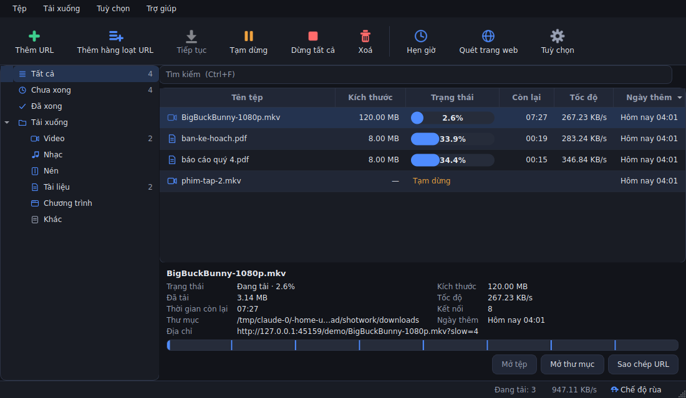

## Đổi tên từ IDMClone (0.4.0)

Phần mềm trước đây tên **IDMClone**, từ 0.4.0 đổi thành **Boltdown**. Người
đang dùng bản cũ không phải cài lại từ đầu:

- Thư mục hồ sơ `%LOCALAPPDATA%\IDMClone` được đổi tên thành `Boltdown` ngay
  lần chạy đầu, kèm theo `idmclone.db` → `boltdown.db` (cả `-wal`/`-shm`, nếu
  bỏ lại thì mất những gì vừa ghi mà chưa checkpoint). Danh sách tải, hàng đợi,
  cài đặt, lịch sử giữ nguyên.
- Biến môi trường cũ `IDMCLONE_HOME` vẫn được chấp nhận, bên cạnh
  `BOLTDOWN_HOME`.
- File tải dở của bản cũ (`*.part` + sidecar `.idmdown`) vẫn tải tiếp được,
  không phải tải lại từ 0.
- Bản cài đặt dùng `AppId` mới, nên **IDMClone cũ không tự bị thay thế** — gỡ
  nó thủ công nếu không muốn giữ hai mục trong Apps & features.

## Cài đặt

Người dùng cuối: chạy `BoltdownSetup-0.7.0.exe` (xem mục [Đóng gói](#đóng-gói)
để tự dựng). Bản cài đặt đã kèm sẵn Python và Qt nên máy sạch không cần cài gì
thêm.

Lập trình viên:

```bash
python -m venv .venv && .venv/Scripts/python -m pip install -e ".[dev]"
```

Phần tải video cần thêm `ffmpeg` trong PATH (hoặc chỉ đường dẫn trong
**Tuỳ chọn → Video**). Thiếu ffmpeg thì app vẫn tải xong, chỉ là để nguyên
`.ts` và không ghép được video với âm thanh.

## Chạy giao diện

```bash
.venv/Scripts/python -m app
```

Cửa sổ chính có thanh công cụ, cây danh mục, bảng tiến độ, khay hệ thống, kéo-thả
link và menu chuột phải. Nhấn `Ctrl+N` để thêm URL, `Ctrl+Shift+N` để thêm hàng
loạt, `Ctrl+V` để dán link từ clipboard, nhấp đúp vào dòng đang tải để mở cửa sổ
tiến độ (biểu đồ tốc độ + bản đồ các đoạn), nhấp đúp vào dòng đã xong để mở tệp.
Hai nút **Hẹn giờ** và **Quét trang web** mở phần hàng đợi và Site Grabber ở dưới.

| | |
|---|---|
| 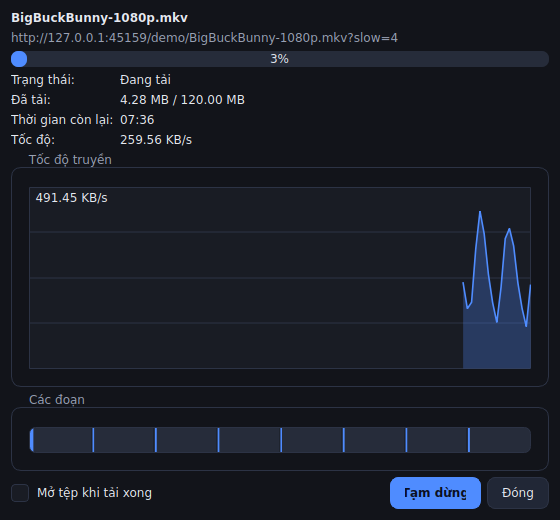 | 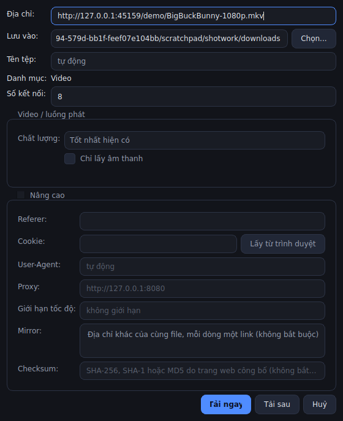 |
| 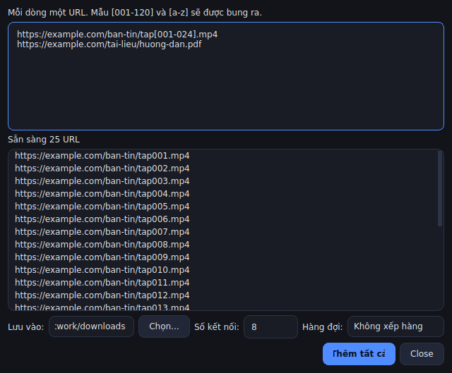 | 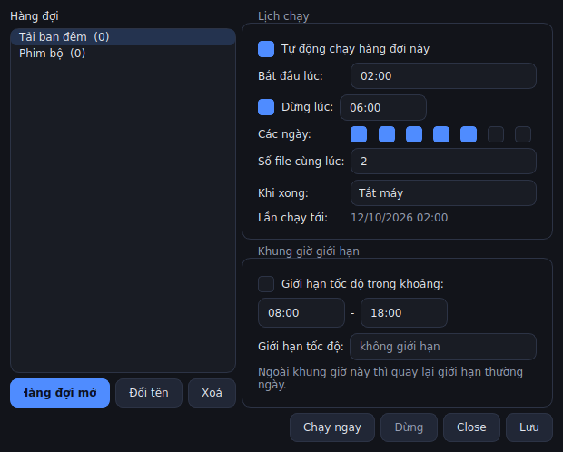 |

### Chín bộ giao diện

**Tuỳ chọn → Giao diện** chọn một trong chín, hoặc để **Theo Windows** cho nó tự
đổi sáng/tối theo hệ thống. Đổi là thấy ngay, không cần khởi động lại — kể cả
icon cũng được vẽ lại theo màu mới.

| | | |
|---|---|---|
| 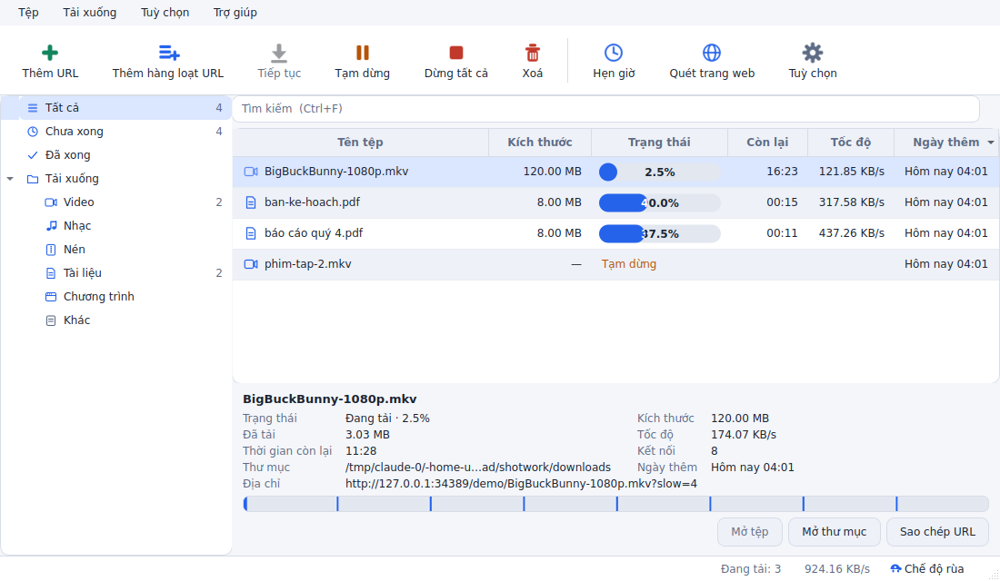<br>**Sáng** | <br>**Tối** | 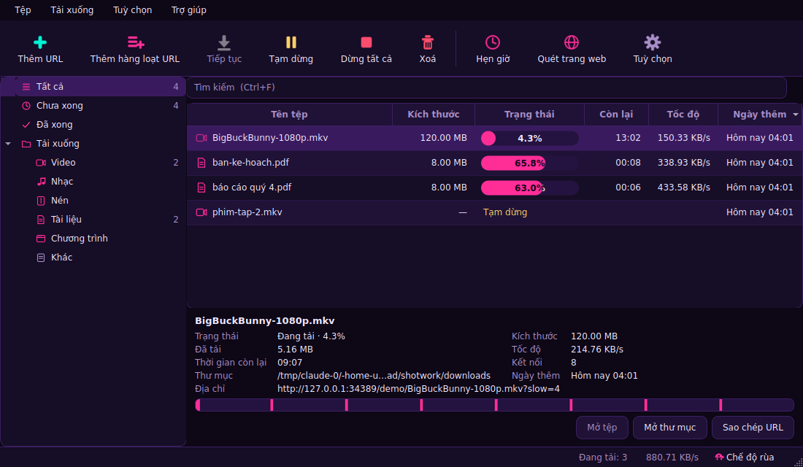<br>**Cyberpunk** |
| 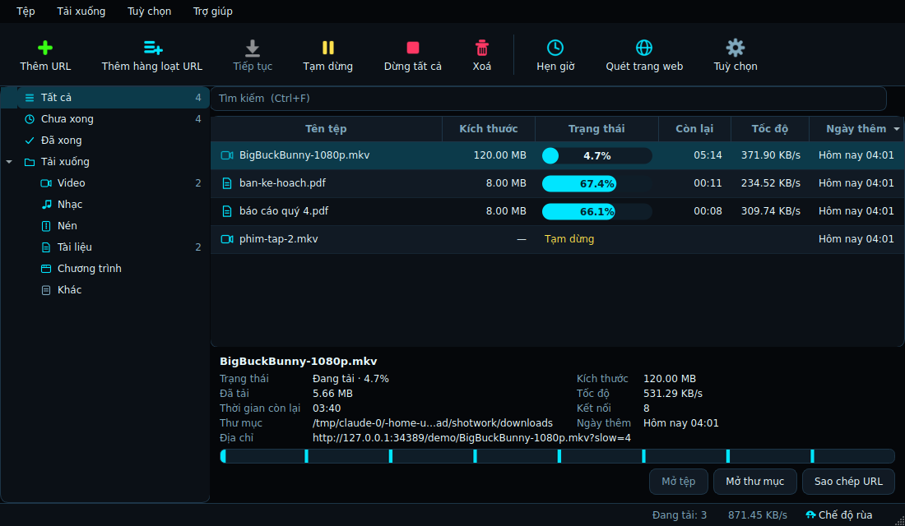<br>**Neon** | 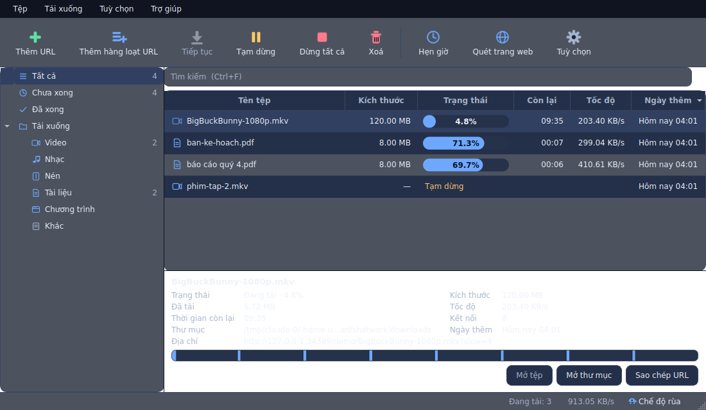<br>**Kính mờ** | 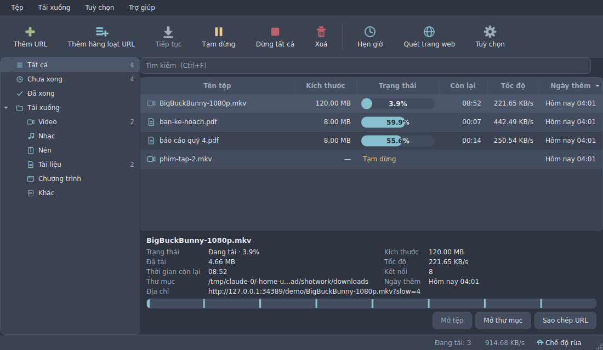<br>**Nord** |
| 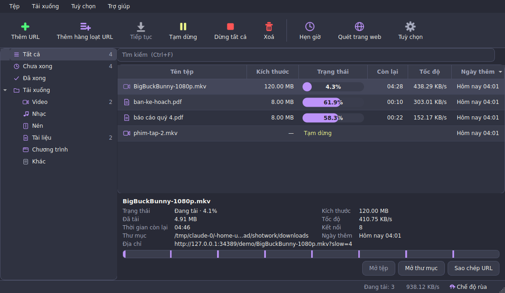<br>**Dracula** | 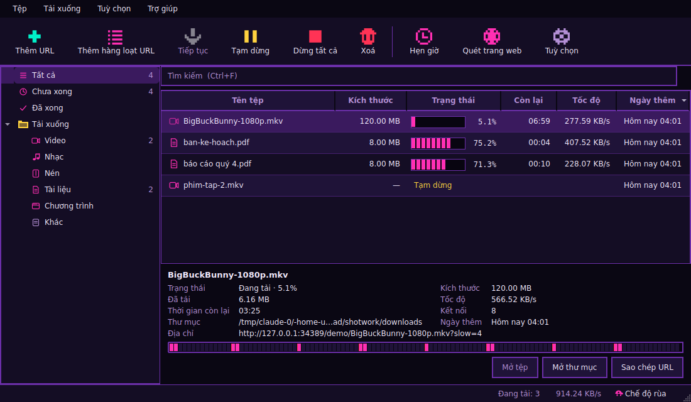<br>**Pixel Cyberpunk** | 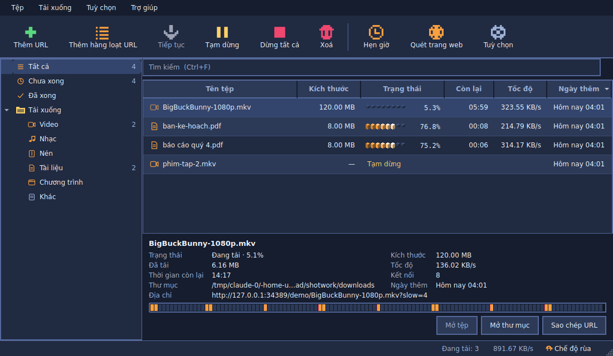<br>**Isometric 3D** |

Vài điểm về cách làm:

- Mỗi theme là **một bộ token màu**, không phải một file CSS riêng — cùng một
  stylesheet sinh ra cho cả chín, nên thêm theme mới chỉ là thêm mười bốn màu.
- Có test kiểm **độ tương phản**: chữ trên nền của *mọi* theme phải đạt tối
  thiểu 4.5:1 (mức AA của WCAG), nên không theme nào đẹp mà khó đọc.
- **Kính mờ** dùng nền trong suốt thật: app xin Windows 11 dựng lớp *acrylic*
  qua `DwmSetWindowAttribute`. Máy Windows 10 hoặc bản 11 cũ thì lời gọi đó
  trượt vô hại và theme lùi về dạng panel mờ, không có blur.
- Icon được **vẽ bằng QPainter theo màu của theme**: nút Thêm lấy màu success,
  Tạm dừng lấy warning, Dừng/Xoá lấy danger. Cyberpunk ra hồng tím, Neon ra
  xanh cyan, không cần bộ icon riêng cho từng theme.

#### Pixel Cyberpunk

Theme thứ tám không chỉ đổi màu mà đổi cả cách vẽ, và lấy tông cyberpunk:
hồng magenta của biển hiệu neon, lơ cyan của dòng chữ *system online*, nền
tím đen như mặt đường sau mưa. Cố ý khác theme **Cyberpunk** thường: bảng
màu này phải sống được khi bị vẽ thành khối phẳng với hai mặt đổ bóng cứng,
nên màu sáng hơn và cách xa nhau hơn.

- **Icon vẽ lại theo lưới 8×8**, mỗi ô là một hình vuông đặc và tắt khử răng
  cưa — phóng to bao nhiêu cũng sắc cạnh, không nhoè. Có test đếm số màu trong
  icon: quá hai màu nghĩa là viền đã bị làm mượt.
- **Thanh tiến độ thành thanh máu**: các ô rời nhau thay vì một vệt liền. Cột
  Trạng thái trong bảng, `QProgressBar` và bản đồ các đoạn đều vậy.
- **Đồ thị tốc độ thành cột equalizer** chia mười nấc, xanh ở dưới, vàng ở
  đỉnh; biểu đồ 30 ngày trong Thống kê xếp bằng các khối 6px.
- **Số liệu dùng font bitmap** (Fixedsys → Terminal → Small Fonts → Consolas,
  lấy cái đầu tiên máy thật sự có). Chữ tiếng Việt vẫn dùng font hệ thống: mấy
  font raster kia chỉ có glyph theo codepage, đem viết nhãn tiếng Việt là ra
  một màn hình toàn ô vuông.
- Bo góc bị ép về 0 và viền dày 2px bằng một khối QSS phụ nối vào cuối
  stylesheet — **không dùng selector `*`** (một lần dùng đã làm bộ test GUI
  chậm gấp bốn), và có test canh đúng chỗ đó.
- **Scanline kiểu màn CRT** phủ lên cảnh thành phố — vẽ sau cùng nên nằm trên
  cả các toà tháp, vì scanline mà dừng ở đường chân trời thì là hình nền chứ
  không phải màn hình. Mỗi toà nhà còn hắt một quầng neon xuống mặt đất.

#### Isometric 3D và thành phố tải xuống

Theme thứ chín vẽ mọi thanh đo bằng **khối lập phương isometric** thay vì ô
phẳng, và mở thêm một khung cảnh động dưới bảng tải.

Về hình học (`app/ui/voxel.py`):

- ô lát tỉ lệ **2:1** — đường 45° đi hai pixel ngang cho mỗi pixel dọc nên rơi
  đúng tâm pixel, khác tỉ lệ là cạnh bị nhấp nháy;
- một khối = **ba hình tứ giác** (mặt trên, trái, phải) tô ba sắc độ của cùng
  một màu; mắt đọc ra ngay là khối đặc được chiếu sáng từ trên trái;
- mỗi tầng trong một tháp có sắc độ riêng, nếu tô một màu phẳng thì các mạch
  nối trùng lên mặt dưới và cả tháp thành một lăng trụ trơn — mất hết ý nghĩa
  của voxel.

Chỗ áp dụng: cột **Trạng thái** thành hàng khối (ô đã tải nổi cao, ô chưa tải
là tấm phẳng), **đồ thị tốc độ** thành đường chân trời các tháp, biểu đồ 30
ngày và thanh tiến độ cũng vậy. Lưu ý nhỏ nhưng quan trọng: trong ô bảng cao
24px thì trục x isometric làm hàng khối **dốc xuống**, nên ở đó camera dịch
theo pixel chứ không đi theo trục lưới.

**Thành phố tải xuống** (`Tuỳ chọn → Thành phố tải xuống`): mỗi mục đang tải là
một toà tháp cao dần theo phần trăm, mỗi mục có một chiếc xe chạy trên đường
với vận tốc lấy từ **tốc độ tải thật**, mây trôi, bầu trời đổi theo **đồng hồ
máy** (đêm có sao, ngày có mặt trời), tải xong thì tháp nhấp nháy và bắn khối
lên trời.

Nó là đồ trang trí, mà đồ trang trí thì phải sòng phẳng về chi phí: **timer chỉ
chạy khi còn thứ gì đang chuyển động**. Danh sách rảnh thì vẽ một khung tĩnh
rồi dừng hẳn — có test canh đúng điều đó, và một test nữa đo thời gian vẽ một
khung phải nằm dưới ngân sách 50ms của 20 khung/giây.

### Chữ và phông

Font bitmap chỉ được dùng cho **chuỗi ASCII** — tốc độ, phần trăm, đồng hồ.
Đây không phải lựa chọn thẩm mỹ mà là bắt buộc: `QFontMetrics.inFont()` **báo
sai** rằng Fixedsys có chữ "ạ", rồi vẽ ra ô vuông. Nên quy tắc phải đặt ở phía
văn bản chứ không phải hỏi font: `theme.font_for(text)` trả về font bitmap khi
`text.isascii()`, còn lại trả về font hệ thống.

Trước khi sửa, ở theme pixel một dòng đã tải xong hiện `Hoàn t▯t`; nay hiện
đúng, kể cả 完了 hay Завершено.

### Chín ngôn ngữ

**Tuỳ chọn → Ngôn ngữ**: Tiếng Việt, English, 简体中文, 日本語, 한국어,
Español, Français, Deutsch, Русский. Mỗi ngôn ngữ hiện **bằng chính nó** trong
danh sách — người chỉ đọc được tiếng Hàn không thể tìm chữ "Korean" trong một
danh sách tiếng Anh.

Tiếng Việt dịch đủ; bảy ngôn ngữ mới phủ phần giao diện người dùng thật sự
nhìn thấy (thanh công cụ, menu, bảng, trạng thái, hộp thoại thêm và cài đặt),
phần còn lại lùi về tiếng Anh. Có test canh **khoá dịch gõ sai** — khoá không
khớp chuỗi nào trong mã nguồn là bản dịch không bao giờ hiện, mà cũng không có
gì báo lỗi.

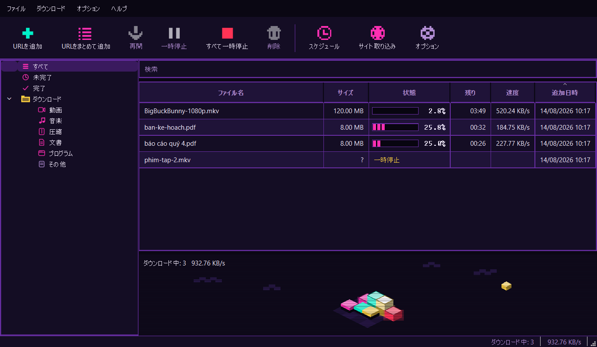

### Hiệu ứng âm thanh 8-bit

**Tuỳ chọn → Hiệu ứng âm thanh**, kèm thanh âm lượng và nút *Nghe thử*. Bốn sự
kiện có tiếng: thêm link (tiếng xu), tải xong (giai điệu 1-up bốn nốt), lỗi (ba
nốt đi xuống), xong cả hàng đợi (fanfare có thêm tiếng trống nhiễu).

Repo không kèm file `.wav` nào — âm thanh được **tự tổng hợp**: sóng vuông,
sóng xung 25%, sóng tam giác và nhiễu trắng, mỗi nốt có bao biên độ vào/ra để
loa không kêu "cạch" ở hai đầu. File WAV sinh một lần rồi nằm trong
`%LOCALAPPDATA%\Boltdown\sounds`.

Vài quyết định đáng nói:

- **Âm lượng được nướng thẳng vào mẫu**, vì trình phát không có nút chỉnh âm
  lượng: mỗi mức là một file riêng.
- Phát bằng `winsound` của thư viện chuẩn với cờ `SND_ASYNC` — không chặn luồng
  giao diện, và không phải kéo cả Qt Multimedia (vài chục MB) vào bản đóng gói
  chỉ để phát bốn tiếng bíp.
- Máy không có thiết bị âm thanh thì `play()` trả về False và ghi log; tải
  xuống không việc gì.
- Có test **đếm điểm cắt không** của sóng để chắc rằng nốt phát ra đúng cao độ
  đã viết (sai số dưới 3%), chứ không chỉ là một mớ byte đúng độ dài.

Ảnh chụp trong tài liệu sinh lại được bằng:

```bash
.venv/Scripts/python scripts/make_screenshots.py --theme dark
.venv/Scripts/python scripts/make_screenshots.py --gallery   # bảng chín theme ở trên
```

## Tích hợp trình duyệt

Hỗ trợ **Chrome, Edge, Chromium, Brave và Firefox**. Cách nhanh nhất là mở
**Tuỳ chọn → Tích hợp trình duyệt** trong app: dialog đó mở sẵn thư mục tiện
ích, chép địa chỉ trang tiện ích, nhận ID và cho biết trình duyệt nào đã đăng ký.
Phần dưới là các bước thủ công tương ứng.

### Chrome / Edge / Brave

Ba bước, làm theo đúng thứ tự vì bước 3 cần ID sinh ra ở bước 2:

1. Chạy app một lần để nó tạo socket IPC: `python -m app`
2. Mở `chrome://extensions` (hoặc `edge://extensions`) → bật **Developer mode** →
   **Load unpacked** → chọn thư mục [extension/](extension/). Copy **ID** hiện ra
   dưới tên extension (32 chữ cái).
3. Đăng ký native messaging host cho ID đó — ba cách, chọn một:

```bash
.venv/Scripts/python -m app.ipc.register --install <extension-id>   # từ mã nguồn
boltdown-cli.exe --register-host <extension-id>                     # bản đóng gói
```

hoặc mở **Tuỳ chọn → Tích hợp trình duyệt**, dán ID vào rồi bấm *Đăng ký* — cách
này không cần dòng lệnh và cũng cho biết trình duyệt nào đã nhận.

Kiểm tra: `--host-status`. Gỡ: `--unregister-host`.

### Firefox

Firefox nói cùng giao thức nhưng khác phương ngữ, nên bản dựng cho nó là một
thư mục riêng:

```bash
.venv/Scripts/python scripts/build_extension.py
```

sinh ra `dist/extension/firefox/` (kèm file `.xpi`) và `dist/extension/chrome/`.
Sau đó mở `about:debugging#/runtime/this-firefox` → **Load Temporary Add-on** →
chọn `dist/extension/firefox/manifest.json`.

Khác biệt so với Chromium, đều đã xử lý sẵn:

| | Chromium | Firefox |
|---|---|---|
| ID tiện ích | đổi mỗi lần nạp unpacked | cố định `boltdown@anct001` |
| manifest native host | `allowed_origins` | `allowed_extensions` |
| khoá registry | `Software\Google\Chrome\…` | `Software\Mozilla\…` |
| script nền | service worker | `background.scripts` |
| `downloads.onDeterminingFilename` | có | **không có** — app dùng `onCreated` |

Vì ID của Firefox cố định nên nó **được đăng ký sẵn** ngay cả khi bạn chỉ dán ID
của Chrome. Hai manifest nằm cạnh nhau (`com.boltdown.host.json` và
`com.boltdown.host.firefox.json`), không đè lên nhau.

Lưu ý: bản add-on chưa ký chỉ nạp tạm được (mất khi đóng Firefox). Muốn cài lâu
dài thì phải ký qua addons.mozilla.org, hoặc dùng Firefox Developer Edition /
Nightly với `xpinstall.signatures.required=false`.

Firefox 115–126 cài add-on MV3 **mà không cấp quyền truy cập trang web**; thiếu
quyền đó thì không có cookie, không bắt được video và không có nút nổi. Popup
sẽ hiện dòng báo và nút **Cho phép** để cấp. Với Firefox Multi-Account
Containers, cookie được lấy từ đúng container của tab.

### Sau khi cài xong

Bấm một link tải bất kỳ trong trình duyệt — extension huỷ download của
trình duyệt và chuyển URL **kèm cookie, referer và User-Agent** sang app (thiếu cookie
thì file cần đăng nhập sẽ tải về thành trang login). Nút nổi "Tải video này" xuất
hiện khi trang có media: link `.m3u8`/`.mpd` đi thẳng vào pipeline video, còn với
YouTube/Vimeo/TikTok... extension gửi **URL của trang** để app hỏi yt-dlp (URL
segment của mấy site này có chữ ký, sniff về cũng vô dụng).

Những thứ dùng hằng ngày, giống IDM:

- **Nút "Tải video này" nằm ngay trên video** khi rê chuột vào trình phát, bấm
  là ra danh sách kèm dung lượng và định dạng. Nút nổi ở góc chỉ còn dành cho
  trang không có trình phát (nhạc, stream, trang yt-dlp) và ẩn được bằng ×.
- **Chuột phải → "Tải các link trên trang này…"** (hoặc `Alt+Shift+L`) mở một
  cửa sổ chọn link: lọc theo tên, bật/tắt theo loại (video, nhạc, file nén, tài
  liệu, ảnh, chương trình, trang). Link điều hướng không được chọn sẵn. Các link
  đã chọn đi sang app trong **một** tin nhắn và không hỏi lại từng link.
- `Alt+Shift+D` tải video trên trang hiện tại.
- Popup có công tắc **"Bắt link trên <trang này>"**; trang **Cài đặt** của
  tiện ích có danh sách trang loại trừ, loại file bỏ qua và dung lượng tối thiểu.
- Danh sách media nhận ra video qua `Content-Type` (kể cả URL không có đuôi),
  bỏ qua segment `.ts`/`.m4s` và file quá nhỏ, và không bao giờ để segment đẩy
  playlist `.m3u8` ra khỏi danh sách.

Nếu app chưa chạy, native host tự khởi động nó rồi mới chuyển link (riêng việc
mở popup chỉ hỏi trạng thái, không khởi động app). Chạy
`python -m app <url>` khi app đang mở thì URL được đẩy vào cửa sổ có sẵn thay vì
mở cửa sổ thứ hai.

Cách hoạt động:

```
Extension ──────native messaging (4-byte length + JSON trên stdio)──> native_host.bat
                                                                              │
        app/ipc/endpoint.py  <──JSON theo dòng, TCP 127.0.0.1 + token──────────┘
                    │
              IpcBridge (queued signal) ──> MainWindow.handle_ipc_download
```

Token nằm trong `%LOCALAPPDATA%\Boltdown\ipc.json`; mọi tin nhắn không có token
đúng đều bị từ chối, nên tiến trình của người dùng khác trên cùng máy không điều
khiển được app dù cổng loopback về mặt kỹ thuật vẫn kết nối được.

Những giới hạn an toàn khác:

- **Native host chỉ chuyển `ping`, `download`, `media`** với URL http(s), và chỉ
  các trường app thực sự đọc. Các lệnh điều khiển (`list`, `pause`, `resume`,
  `show`) là của `boltdown-cli`, trình duyệt không gọi được.
- **Trang web không chọn được cookie của ai bị gửi đi.** Content script chỉ được
  gửi media mà chính tab đó đã tải (hoặc địa chỉ trang); cài đặt, gửi URL tuỳ ý
  và hỏi tab khác là việc riêng của popup.
- **Cookie đúng danh tính:** link trong cửa sổ ẩn danh đi với cookie ẩn danh,
  link trong container Firefox đi với cookie của container đó.
- **Cửa sổ ẩn danh không bị bắt mặc định** — bật "Bắt cả trong cửa sổ ẩn danh"
  trong popup nếu muốn (chỉ hiện khi đã cho phép tiện ích chạy ở chế độ ẩn danh).
- **Cookie chỉ đi tới đúng site:** app gắn cookie của trình duyệt cho từng
  request, giữ nó qua redirect trong cùng site (trước đây httpx bỏ cookie ở mọi
  redirect, nên file sau đăng nhập tải về thành trang login) và không gửi nó
  sang site khác — kể cả CDN mà yt-dlp trỏ tới — hay xuống http thường.

Giao diện extension có tiếng Anh và tiếng Việt, theo ngôn ngữ của trình duyệt.

### Đo hiệu năng

```bash
npm install playwright            # ở đâu cũng được, rồi trỏ NODE_PATH vào đó
NODE_PATH=path/to/node_modules python scripts/bench_browser.py --runs 5
```

Chạy Chromium thật với bản extension đã build, native host thật và endpoint IPC
thật (chỉ thay cửa sổ app bằng một bản ghi). Phần bắt download chạy trên một
Chromium không gắn công cụ tự động nào: dưới Playwright, trình duyệt tự xử lý
download theo cách khác và `onDeterminingFilename` không bao giờ được gọi.
`tests/test_browser_e2e.py` chạy bài đo này và giữ các ngưỡng; test tự bỏ qua
trên máy không có Chromium/Playwright. Kết quả đo trên Linux, máy chủ web cục bộ
phát file ở 12 MB/s:

| | trước | sau |
|---|---|---|
| trình duyệt yêu cầu file → app có URL (trung vị) | 70 ms | 10 ms |
| dữ liệu trình duyệt tải thừa trước khi nhả file | 960 KB | 256 KB |
| "tải mọi link" với 52 link | 52 tin nhắn, 3.0 s | 1 tin nhắn, 0.03 s |
| trang HLS tải 60 segment | playlist bị đẩy mất | chỉ còn playlist |
| video chỉ lộ qua `Content-Type` | không thấy | thấy, kèm dung lượng |

Phần lớn chênh lệch về tốc độ đến từ việc giữ **một** tiến trình native host cho
cả phiên (`connectNative`) thay vì khởi động một tiến trình Python mới cho mỗi
link. Trên Windows, bản đóng gói khởi động chậm hơn nhiều, nên mức chênh ở đó
sẽ lớn hơn, nhưng con số đó chưa được đo. Ngoài ra, download của trình duyệt bị
**tạm dừng** ngay khi được phát hiện, trong lúc hỏi app: nếu app không trả lời
thì download được chạy tiếp, không bị mất.

## Dùng bằng dòng lệnh

```bash
.venv/Scripts/python -m app "https://example.com/file.zip" -o D:\Downloads -n 16
```

Các tuỳ chọn hay dùng:

| Cờ | Ý nghĩa |
|---|---|
| `-n 16` | 16 segment cho mỗi file (1–32, mặc định 8) |
| `-j 3` | số file tải song song |
| `-l 2M` | giới hạn tốc độ tổng (`500k`, `1.5M`, ...) |
| `--categories` | tự xếp file vào `Video/`, `Music/`, `Compressed/`, ... |
| `--cookie`, `--referer`, `--user-agent`, `-H "K: V"` | tải file cần đăng nhập |
| `--proxy http://127.0.0.1:8080` | đi qua proxy |
| `--video`, `--quality 1080`, `--audio-only`, `--list-formats` | phần video, xem mục dưới |

Nhấn `Ctrl+C` để tạm dừng — tiến độ được ghi lại, chạy **đúng lệnh cũ** để tải tiếp.

## Tải video (HLS / DASH / YouTube)

Link `.m3u8` và `.mpd` được nhận ra ngay từ URL nên không cần cờ gì thêm; trang
video thì thêm `--video`:

```bash
.venv/Scripts/python -m app "https://cdn.example.com/vod/ep-7/master.m3u8" -o D:\Videos
.venv/Scripts/python -m app "https://www.youtube.com/watch?v=..." --video --quality 1080
.venv/Scripts/python -m app "https://www.youtube.com/watch?v=..." --list-formats
```

Ba đường đi, chọn theo URL:

| URL | Cách làm |
|---|---|
| `.m3u8` | tự phân tích playlist, tải các segment song song, giải mã AES-128, ghép rồi remux sang `.mp4` |
| `.mpd` | yt-dlp đọc manifest, lấy direct URL rồi trả về engine đa luồng |
| trang video (YouTube, Vimeo, TikTok...) | yt-dlp lấy danh sách format, chọn video + audio tốt nhất, tải bằng engine đa luồng rồi `ffmpeg -c copy` ghép lại |

Điểm khác biệt với yt-dlp chạy một mình: yt-dlp **chỉ làm việc bóc URL**, còn
phần tải vẫn là engine chia đoạn của app — nên vẫn nhanh gấp nhiều lần và vẫn
resume được. Tạm dừng giữa chừng thì các segment đã tải nằm trong thư mục
`<tên video>.boltmedia` cạnh file đích; chạy lại là tải tiếp từ đó.

`--quality 1080` là **chặn trên**: nếu không có bản 1080p thì lấy bản cao nhất
còn dưới mức đó. Không có audio riêng thì bản 360p có tiếng được ưu tiên hơn bản
1080p câm.

### Phụ đề và ảnh bìa

**Tuỳ chọn → Video**: ô *Phụ đề* nhận danh sách ngôn ngữ (`vi, en`) hoặc `all`;
tick *Gắn ảnh thumbnail làm ảnh bìa*. Phụ đề do người làm được ưu tiên hơn phụ
đề tự động; `en` lấy cả `en-US` khi không có `en` trơn; `all` chỉ lấy phụ đề do
người làm (YouTube có caption máy cho cả trăm ngôn ngữ). Có ffmpeg và file là
MP4/MKV thì phụ đề (mov_text trong MP4, srt trong MKV, có gắn mã ngôn ngữ) và ảnh
bìa được ghép thẳng vào file mà không encode lại; không thì lưu cạnh file với
tên trình phát tự tìm: `Phim.vi.vtt`, `Phim.jpg`. Lỗi ở bước này không bao giờ
làm hỏng lượt tải — video đã xong rồi.

## Bắt link từ clipboard

Bật ở **Tuỳ chọn → Clipboard** (hoặc menu Tuỳ chọn, hoặc chuột phải vào biểu
tượng khay): copy một link là app hỏi tải ngay. Hai luật giữ cho nó không phiền:

- **Chỉ tính link trơ** — nội dung copy phải đúng là một URL, copy cả đoạn văn
  có chứa link thì bỏ qua.
- **Chỉ những đuôi bạn liệt kê** (mặc định `zip, rar, 7z, exe, msi, iso, pdf,
  mp3, mp4, mkv`), nên copy link bài báo không kích hoạt gì.

Bấm *Sao chép URL* ngay trong app cũng không kích hoạt lại chính nó — link đó
được đánh dấu bỏ qua đúng một lần.

## Thêm hàng loạt URL

`Ctrl+Shift+N` mở ô dán nhiều dòng, và hiểu mẫu kiểu IDM:

```
https://example.com/ban-tin/tap[001-024].mp4     -> 24 URL, giữ nguyên số 0 ở đầu
https://example.com/vol[a-e]/data.zip            ->  5 URL
https://example.com/[1-3]/[a-b].txt              ->  6 URL (mọi tổ hợp)
```

Danh sách bung ra được xem trước trước khi thêm, có khử trùng lặp, và bị chặn
nếu mẫu sinh quá 10.000 URL (`app/util/patterns.py`).

## Lịch sử và kiểm tra checksum

Ô **Tìm kiếm** trên danh sách (`Ctrl+F`, `Esc` để xoá) tìm trong tên file, địa
chỉ, trang nguồn và nội dung lỗi; gõ có dấu hay không đều được ("bao cao" khớp
"Báo cáo"), nhiều từ thì phải khớp hết, bên cạnh hiện số kết quả.

Mục đã tải xong được ghi vào bảng `history` ngay lúc xong, nên xoá khỏi danh
sách vẫn tra lại được: **Tệp → Lịch sử** cho tìm kiếm, copy URL, tải lại hoặc
xoá. Chuột phải một mục đã xong → **Kiểm tra checksum** để tính SHA-256/MD5/SHA-1
(chạy trên luồng nền, có thanh tiến độ) rồi dán giá trị trên trang tải về vào để
so — chấp nhận cả kiểu `<hash>  <tên tệp>` copy thẳng từ file `.sha256`.

### Tự kiểm tra khi tải xong

- **Dán checksum lúc thêm link** — ô **Checksum** trong phần *Nâng cao* của hộp
  thoại thêm link nhận SHA-256, SHA-1, SHA-512 hoặc MD5 (tự nhận ra theo độ dài),
  kể cả `sha256:…`, `<hash>  <tên tệp>` hay kiểu BSD `SHA256 (tệp) = …`.
- **Tự tìm checksum trang web công bố** — với file cài đặt, file nén và ảnh đĩa
  từ 1 MB trở lên (`.iso`, `.exe`, `.msi`, `.zip`, `.7z`, `.dmg`, `.apk`, …), khi
  tải xong app thử `<file>.sha256`, `.sha512`, `.sha1`, `.md5` rồi `SHA256SUMS`,
  `sha256sums.txt`, `SHA512SUMS`, `checksums.txt`, `MD5SUMS` trong cùng thư mục.
  Phần `?chữ-ký` của link được bỏ đi khi đoán; không gửi cookie; mỗi file listing
  đọc tối đa 512 KB. Tắt trong **Tuỳ chọn → Danh mục** nếu không muốn.
- Khớp thì báo xanh. Lệch thì báo đỏ kèm tiếng báo lỗi, lượt tải ghi lỗi
  `SHA256 mismatch: expected …, got …`, và **file không được giải nén hay quét
  tiếp** — một file khác với file đã công bố không nên được mở.

## Làm mới địa chỉ tải

Link có chữ ký hoặc có hạn (host file, ổ đĩa đám mây, CDN) hết hạn sau một lúc,
và tải tiếp lúc đó chỉ nhận về 403/410. Chuột phải lượt tải chưa xong →
**Làm mới địa chỉ tải…**:

- **Dán link mới**, hoặc
- **Lấy từ trình duyệt** — app mở lại trang nguồn; bấm lại link tải trên trang
  đó, extension bắt link và gắn vào *lượt tải cũ* (kèm cookie mới) thay vì tạo
  lượt mới. Link có kích thước khác hẳn thì được coi là file khác và thêm như
  bình thường; app chờ tối đa 5 phút.

Phần đã tải được giữ: file `.part` được ghi nhận là của lượt tải này, còn kích
thước và ETag server trả về cho link mới vẫn quyết định có dùng lại các byte đó
hay không. Lượt tải đang chạy cũng đổi được: nó tạm dừng, đổi link rồi chạy tiếp.

## Hộp thả nổi

**Tuỳ chọn → Hộp thả nổi** bật một ô nhỏ luôn nổi trên các cửa sổ khác: kéo link
từ trình duyệt thả vào là tải, không cần alt-tab. Kéo chính nó để đổi chỗ (vị trí
được nhớ lại), nhấp đúp để mở cửa sổ chính, chuột phải để ẩn.

## Quy tắc theo trang

**Tuỳ chọn → Quy tắc theo trang** ghi sẵn cách cư xử với từng tên miền: số kết
nối, giới hạn tốc độ, User-Agent, Referer, Cookie, proxy. Mẫu khớp là
`example.com`, `*.example.com` hoặc `*`, và **khớp hẹp nhất thắng** — đặt một
luật chung rồi sửa riêng cho một host khó tính. Ô để trống thì không đụng tới;
giá trị gõ cho từng lượt tải luôn thắng quy tắc.

Đây là cách xử lý thực tế khi một CDN trả 403 lúc mở quá 4 kết nối trong khi
chỗ khác cho 16.

- **Đăng nhập** — *Tên đăng nhập* / *Mật khẩu* cho trang đòi HTTP Basic hoặc
  Digest: app đọc lời thách 401 rồi chọn đúng kiểu, và không bao giờ gửi kèm
  thông tin đăng nhập khi bị chuyển hướng sang tên miền khác. Mật khẩu được mã
  hoá bằng DPAPI của Windows (chỉ tài khoản Windows của bạn giải được) trước khi
  ghi vào cơ sở dữ liệu.
- **Thư mục lưu** — ví dụ `{host}/{year}-{month}` hoặc `D:\Work\{category}`.
  Trường dùng được: `{host} {date} {year} {month} {day} {category}`. Đường dẫn
  tương đối nằm trong thư mục tải mặc định; ký tự Windows không cho phép bị thay
  bằng `_` và `..` bị bỏ. Hộp thoại thêm link điền sẵn thư mục này, vẫn đổi tay
  được.

## Nhiều nguồn (mirror)

Ô **Mirror** trong phần *Nâng cao* của hộp thoại thêm link nhận thêm các địa chỉ
khác của cùng file, mỗi dòng một link. Trước khi tải, mỗi mirror được thử: chỉ
mirror trả đúng kích thước và cho tải theo đoạn mới được dùng. Các kết nối được
chia vòng tròn giữa các nguồn, nên hai server mỗi cái 8 MB/s cho ra gần 16 MB/s;
một mirror hỏng giữa chừng thì kết nối đó quay về link chính và tải tiếp từ đúng
chỗ đang dở. Danh sách mirror được lưu cùng lượt tải nên tạm dừng rồi tiếp tục
vẫn dùng lại.

## Báo về điện thoại

**Tuỳ chọn → Điện thoại** gửi tin khi một file tải xong, tải lỗi (kể cả sai
checksum) hoặc một hàng đợi chạy xong — tiện khi để máy tải qua đêm:

- **ntfy** — không cần tài khoản: cài app ntfy, đăng ký một *topic* có tên dài
  khó đoán, dán tên đó vào. Dùng `ntfy.sh` hoặc server ntfy riêng.
- **Telegram** — tạo bot với @BotFather, dán token và chat id. Token được mã hoá
  như mật khẩu ở trên.

Nút *Gửi thử* kiểm tra ngay. Tin được gửi trên luồng riêng nên mạng chậm không
làm đứng cửa sổ hay lượt tải; tin gửi qua proxy đã đặt trong app.

## Playlist và kênh video

**Tệp → Danh sách phát**: dán link playlist/kênh, bấm *Liệt kê video*, tick
những video muốn tải, tất cả vào chung một hàng đợi. Bản liệt kê dùng
`extract_flat` nên kênh 200 video vẫn hiện ra sau **một** request chứ không
phải 200. Dòng lệnh: `--playlist`.

## Proxy, cookie và vài thứ nhỏ

- **SOCKS5**: gõ `socks5://127.0.0.1:1080` vào ô Proxy. **Dùng thiết lập proxy
  của Windows** thì đọc thẳng WinINET; gặp tệp PAC thì app chỉ bóc các dòng
  `PROXY host:port` — đánh giá đúng `FindProxyForURL` cần cả một máy JavaScript,
  nên chỗ này ghi rõ là *phỏng đoán* chứ không giả vờ chính xác.
- **Lấy cookie từ trình duyệt**: nút cạnh ô Cookie đọc cookie của đúng tên miền
  đó từ Chrome/Edge/Brave (khoá AES qua DPAPI, giá trị AES-256-GCM). Chỉ tài
  khoản Windows hiện tại giải được hồ sơ của chính mình.
- **Danh mục sửa được**: **Tuỳ chọn → Danh mục**, mỗi dòng `Tên = đuôi, đuôi`.
- **Chế độ portable**: đặt tệp rỗng tên `boltdown.portable` cạnh exe, dữ liệu và
  cấu hình chuyển vào thư mục `data` bên cạnh chương trình.
- **Sau khi tải xong**: tuỳ chọn tự giải nén (chặn đường dẫn thoát khỏi thư mục)
  và quét bằng Microsoft Defender; thêm URL đã tải rồi thì app hỏi lại trước.

## Thống kê

**Tệp → Thống kê** đọc thẳng bảng `history`: tổng dung lượng, trung bình mỗi
tệp, trung bình mỗi ngày, tệp lớn nhất, kèm biểu đồ 30 ngày. Không có sổ sách
riêng nào để lệch.

## Điều khiển từ dòng lệnh

Khi app đang chạy, `boltdown-cli` nói chuyện với nó qua socket IPC sẵn có:

```bash
boltdown-cli --remote-add "https://example.com/file.zip"
boltdown-cli --remote-list
boltdown-cli --remote-pause 3      # bỏ số để dừng tất cả
boltdown-cli --remote-resume
boltdown-cli --check-update
```

## Hàng đợi và hẹn giờ

**Hẹn giờ** (`Ctrl` không cần, bấm nút trên thanh công cụ) mở cửa sổ quản lý hàng
đợi. Mỗi hàng đợi có: số file chạy cùng lúc, giờ bắt đầu, giờ dừng (tuỳ chọn),
các thứ trong tuần, và **hành động khi xong**: không làm gì / thoát app / tắt máy
/ ngủ đông / ngủ.

Đưa file vào hàng đợi bằng chuột phải → **Chuyển vào hàng đợi**, hoặc chọn hàng
đợi ngay trong Site Grabber. File nằm trong hàng đợi thì không tự tải — nó chờ
tới lượt.

Ba quy tắc đáng nhớ:

- **Lỡ giờ vẫn chạy**: hẹn 02:00 mà máy tắt, 07:00 mới mở app thì hàng đợi vẫn
  bắt đầu (trừ khi đã đặt giờ dừng và giờ đó đã qua). Mỗi mốc chỉ chạy đúng
  một lần, ghi lại ở cột `last_run`.
- **Tạm dừng bằng tay là quyết định của người dùng**: hàng đợi chuyển sang file
  kế tiếp chứ không tự bật lại file bạn vừa dừng. Bấm *Chạy ngay* thì mới bỏ
  qua điều đó.
- **File lỗi không được thử lại vòng lặp** — hàng đợi bỏ qua nó, tránh cảnh một
  link 404 làm hàng đợi quay mãi.

Trước khi tắt máy, app đếm ngược 30 giây và cho bấm huỷ; lệnh tắt máy chỉ chạy
sau khoảng đó (`app/util/power.py`).

Cùng cửa sổ đó còn có **Khung giờ giới hạn**: bóp tốc độ trong giờ làm việc,
hết khung là tự trả lại giới hạn thường ngày — một lớp đè tạm thời, không
phải thiết lập thứ hai phải nhớ đồng bộ.

## Site Grabber

Quét một trang rồi tải hàng loạt thứ nó liên kết tới:

```bash
.venv/Scripts/python -m app "https://example.com/gallery/" --grab --depth 1 \
    --filter jpg,png --max-pages 20 -o D:\Pictures
```

| Cờ | Ý nghĩa |
|---|---|
| `--grab` | coi URL là trang cần quét, không phải file |
| `--depth N` | đi theo bao nhiêu lớp liên kết (0 = chỉ trang đó) |
| `--filter jpg,png` | chỉ giữ các đuôi này (bỏ trống = mọi tệp không phải trang) |
| `--match`, `--exclude` | lọc URL bằng biểu thức chính quy |
| `--max-pages` | trần số trang được tải về để phân tích |
| `--dry-run` | chỉ in danh sách tìm được, không tải |

Trong giao diện, nút **Quét trang web** làm đúng việc đó và thêm bảng chọn từng
file, mẫu lọc sẵn (Ảnh / Video / Âm thanh / Nén / Tài liệu) và ô chọn hàng đợi
đích. Quá trình quét chạy trên đúng event loop của engine
(`Engine.run_coroutine`) nên cửa sổ không đứng.

Crawler cố tình đơn giản: BFS theo depth, chỉ đọc `text/html`, chỉ đi trong cùng
tên miền (tệp ở CDN khác vẫn lấy), có trần số trang lẫn số link, không chạy
JavaScript. Mỗi kết quả nhớ trang đã dẫn tới nó và dùng làm `Referer` khi tải —
thiếu cái đó nhiều CDN trả 403.

## Đóng gói

```bash
.venv/Scripts/python -m pip install pyinstaller
.venv/Scripts/python scripts/build.py            # thêm --no-installer nếu chưa có Inno Setup
```

Ra hai thứ trong `dist/`:

- `dist/Boltdown/` — thư mục chạy được ngay, ~104 MB, gồm **ba** exe dùng chung
  một bản Qt:

| Tệp | Kiểu | Việc |
|---|---|---|
| `Boltdown.exe` | windowed | giao diện, cái người dùng bấm |
| `boltdown-cli.exe` | console | dòng lệnh + `--register-host` trên máy không có Python |
| `boltdown-host.exe` | console | native messaging cho Chrome/Edge |

- `dist/BoltdownSetup-0.7.0.exe` — bản cài đặt Inno Setup, ~50 MB (chỉ dựng khi
  máy có `ISCC.exe`; không có thì bước này được bỏ qua kèm lời nhắc). Cài Inno
  Setup bằng `winget install --id JRSoftware.InnoSetup -e`; bản winget không cần
  quyền admin nên nó nằm ở `%LOCALAPPDATA%\Programs\Inno Setup 6` — `build.py`
  tìm cả chỗ đó chứ không chỉ `Program Files`.

Vài chỗ cố ý:

- **One-dir chứ không one-file.** Bản one-file giải nén ra `%TEMP%` mỗi lần chạy:
  chậm vài giây và gần như chắc chắn bị antivirus soi. Cũng vì lý do đó mà không
  bật UPX.
- **Tên ba exe phải khác nhau nhiều hơn một chữ hoa.** Tên tệp trên Windows không
  phân biệt hoa thường, nên `boltdown.exe` sẽ **ghi đè** `Boltdown.exe` ngay
  trong thư mục dist — bản build đầu tiên dính đúng lỗi này, giờ có test canh.
- **Host là exe console riêng.** Native messaging chạy trên stdio mà bản windowed
  thì không có stdio; tách ra còn giúp tiến trình Chrome sinh ra không phải nạp Qt.
- Bỏ `opengl32sw.dll` (19,7 MB, chỉ QtQuick/QOpenGLWidget dùng) và toàn bộ
  `PySide6/translations` (6,5 MB, chuỗi của app nằm ở `app/ui/i18n.py`, hộp thoại
  tệp là hộp thoại của Windows) — nhẹ đi ~26 MB.
- Icon `packaging/boltdown.ico` được sinh từ chính hàm vẽ Qt của app
  (`scripts/make_app_icon.py`) nên repo không phải giữ ảnh nhị phân thủ công.

Bản cài đặt là **per-user** (`PrivilegesRequired=lowest`): không cần UAC, cài vào
`%LOCALAPPDATA%\Programs\Boltdown`, và mọi thứ nó ghi đều nằm trong `HKCU` —
shortcut, tuỳ chọn chạy cùng Windows (`--tray`), còn khi gỡ thì gọi
`boltdown-cli.exe --unregister-host` để dọn đăng ký native messaging. Chạy ở chế
độ admin thì `HKCU` lại là hive của admin chứ không phải người dùng thật, nên bản
này không mở đường cài "cho mọi người". Nó cũng **không** tự đăng ký host lúc
cài, vì manifest phải nêu đích danh ID của extension mà ID của bản unpacked thì
mỗi máy một khác.

## Ký số

```bash
.venv/Scripts/python scripts/sign.py --make-cert     # một lần: chứng chỉ thử
.venv/Scripts/python scripts/build.py --sign         # build + ký cả 3 exe lẫn installer
.venv/Scripts/python scripts/sign.py --verify
```

`--sign` ký **trước** khi Inno Setup đóng gói, nên file nằm trong máy người dùng
sau khi cài cũng có chữ ký, rồi mới ký tới bản cài đặt. Chữ ký dùng SHA-256 và có
timestamp (`timestamp.digicert.com`) để vẫn hợp lệ sau khi chứng chỉ hết hạn.
Việc ký chạy qua `Set-AuthenticodeSignature` của PowerShell chứ không cần
`signtool.exe` (thứ chỉ có khi cài Windows SDK).

**Chứng chỉ tự ký không làm SmartScreen im lặng.** Nó chỉ chứng minh file không
bị sửa sau khi ký và cho publisher một danh tính ổn định — đủ cho phát hành nội
bộ và cho việc kiểm tra bản cập nhật. Trạng thái báo về sẽ là `UnknownError`
(chuỗi tin cậy không dẫn tới CA nào Windows biết), và đó là điều bình thường:

```
Boltdown.exe             UnknownError   CN=Boltdown Test Signing (self-signed) (timestamped)
BoltdownSetup-0.7.0.exe  UnknownError   CN=Boltdown Test Signing (self-signed) (timestamped)
```

Muốn hết cảnh báo "nhà phát hành không xác định" thì phải mua chứng chỉ ký mã của
một CA Windows đã tin (OV/EV, từ 2023 khoá bắt buộc nằm trên token phần cứng hoặc
HSM), hoặc dùng dịch vụ như Azure Trusted Signing; riêng OV còn phải tích luỹ
"reputation" theo lượt tải thì SmartScreen mới thôi chặn. Khi có chứng chỉ thật:
nạp `.pfx` vào `Cert:\CurrentUser\My` rồi chạy đúng lệnh trên, thêm
`--thumbprint <dấu vân tay>` nếu trong máy có nhiều chứng chỉ — không phải sửa gì
trong mã.

Hai chỗ cần biết:

- Chứng chỉ thử nằm ở `Cert:\CurrentUser\My`, **không** được tự thêm vào kho gốc
  tin cậy: làm vậy nghĩa là máy tin mọi thứ ký bằng khoá đó. `--make-cert` in sẵn
  lệnh nếu bạn muốn tự làm khi test.
- `unins000.exe` do Inno Setup sinh ra **trên máy người dùng lúc cài**, nên không
  ký được từ đây; muốn ký thì cần chỉ thị `SignTool`/`SignedUninstaller` của Inno
  cùng một chứng chỉ thật.

## Chạy cùng Windows

**Tuỳ chọn → Cài đặt chung → Chạy cùng Windows** ghi khoá `HKCU\...\Run` trỏ tới
app kèm cờ `--tray` (mở thẳng xuống khay, không bung cửa sổ vào mặt người dùng
lúc đăng nhập). Chạy từ mã nguồn thì khoá trỏ vào `boltdown-gui.exe` trong
`.venv\Scripts` — `python -m app` không dùng được vì Run khởi động tiến trình ở
`system32`, chỗ đó không import được package.

## Kiến trúc

```
app/
  gui.py              entry point giao diện
  cli.py              CLI + thanh tiến độ
  core/
    engine.py         event loop asyncio trên 1 thread nền, API thread-safe cho GUI
    task.py           TaskRunner: probe -> segment -> resume -> đổi tên file
    schedule.py       logic thuần: mốc giờ, thứ trong tuần, hành động khi xong
    segment.py        SegmentWorker: stream 1 range, retry có backoff
    probe.py          dò size / hỗ trợ Range / ETag / tên file
    writer.py         ghi theo offset, mỗi segment 1 fd riêng
    resume.py         sidecar .boltdown (ghi atomic)
    ratelimit.py      token bucket (toàn cục + theo task)
  media/
    detect.py         URL này là file thường, playlist hay trang video?
    m3u8.py           parser playlist HLS (master/media, key, byterange, map)
    hls.py            tải segment song song, giải mã AES-128, ghép + remux
    ytdlp.py          bóc format bằng yt-dlp rồi giao URL cho engine
    ffmpeg.py         dò binary, concat/remux/merge bằng stream copy
    runner.py         MediaTaskRunner: cùng giao diện với TaskRunner
  ipc/
    protocol.py       framing native messaging + JSON theo dòng cho IPC nội bộ
    endpoint.py       IpcServer/send: loopback TCP + token, single instance
    native_host.py    host stdio cho Chrome/Edge, tự khởi động app khi cần
    register.py       ghi manifest + registry cho Chrome/Edge/Chromium/Brave
  grabber/
    crawler.py        BFS theo depth, lọc đuôi file/regex, chỉ đọc text/html
  ui/
    theme.py          bảng màu + QSS, tự đổi sáng/tối theo Windows
    controller.py     cầu nối engine <-> SQLite <-> Qt (marshal qua queued signal)
    scheduler.py      đọc lịch, bật/tắt hàng đợi, xin hành động khi xong
    clipboard_watch.py  bắt link vừa copy; dropbox.py  hộp thả nổi
    batch_dialog.py / history_dialog.py / checksum_dialog.py
    ipc_bridge.py     tin nhắn từ trình duyệt -> hành động trên GUI thread
    main_window.py    thanh công cụ, cây danh mục, bảng tiến độ, kéo-thả
    task_model.py     QAbstractTableModel + delegate vẽ thanh tiến độ
    progress_dialog.py biểu đồ tốc độ + bản đồ segment
    queue_dialog.py   hàng đợi + lịch chạy; grabber_dialog.py  Site Grabber
    add_url_dialog.py / settings_dialog.py / tray.py / icons.py / i18n.py
  storage/            db.py (SQLite, có migration) + settings.py
  util/               power.py (tắt máy/ngủ đông), autostart.py (khoá Run),
                      patterns.py (mẫu [001-100]), filenames.py, fmt.py, paths.py
extension/            MV3: background.js (bắt download + sniff media),
                      content.js (nút nổi), popup/
packaging/            boltdown.spec (3 exe), installer.iss (Inno Setup),
                      entry_*.py (điểm vào cho bản frozen), boltdown.ico
scripts/              build.py, sign.py, verify_p1.py, verify_p5.py, verify_p6.py,
                      make_app_icon.py, make_extension_icons.py, make_screenshots.py
```

Những điểm thiết kế đáng chú ý:

- **Dynamic segmentation theo tốc độ** — kết nối nào rảnh sẽ lấy phần việc của
  segment *dự kiến xong muộn nhất* (số byte còn lại chia cho tốc độ kết nối của
  nó), không phải segment còn nhiều byte nhất (`TaskRunner._steal_work`). Phần
  còn lại được chia sao cho hai bên xong cùng lúc, có tính cả một vòng khứ hồi
  cho yêu cầu mới; kết nối đang nghẽn chỉ giữ lại phần nó đã nhận. Không có cơ
  chế này thì một kết nối chậm sẽ kéo lùi cả file.
- **Một vòng khứ hồi tới byte đầu tiên** — probe là `GET` với `Range: bytes=0-`;
  câu trả lời cho biết kích thước và khả năng resume, còn phần thân của nó chính
  là segment 0, nên kết nối đầu tiên tải luôn thay vì HEAD, probe một byte rồi mới
  gửi yêu cầu thật. File nhỏ chỉ tốn đúng một request.
- **Tôn trọng giới hạn kết nối của server** — nhiều host chỉ phục vụ vài kết nối
  mỗi IP và trả 503/429 cho phần còn lại. Trước đây các kết nối bị từ chối cứ thử
  lại cho tới hết lượt rồi làm hỏng cả lượt tải. Giờ engine nhớ số kết nối nhiều
  nhất server từng phục vụ cùng lúc: bị từ chối ở mức đó thì kết nối trả segment
  lại và chờ tới lượt; bị từ chối dưới mức đó (server chưa kịp đóng kết nối cũ)
  thì hỏi lại sau 50 ms. Kết nối được phục vụ nhận nguyên các segment bị trả, và
  nếu luồng nó đang đọc chạy tiếp đúng vào segment đó thì đọc luôn, không gửi
  request mới.
- **Rớt kết nối giữa chừng thì nối lại ngay** — nếu vừa nhận được dữ liệu, worker
  gửi lại yêu cầu sau 50 ms; chỉ khi server từ chối liên tục mới lùi dần thời gian
  chờ.
- **Ghi trước, ghi sổ sau** — `segment.done` (và file `.boltdown`) chỉ tăng *sau khi*
  dữ liệu đã nằm trên đĩa, nên metadata không bao giờ khai nhiều hơn thực tế. Mất
  điện chỉ khiến tải lại vài trăm KB, không bao giờ hỏng file.
- **Tên tệp được chốt trước khi ghi byte đầu tiên** — `TaskRunner._claim_target`
  chọn tên còn trống rồi *giữ chỗ* file `.part` đó trong suốt vòng đời task. Không
  có bước này thì hai lượt tải cùng ra một tên sẽ dùng chung một file `.part`: cái
  xong trước đổi tên, cái còn lại chết vì mất file.
- **Đa luồng không cần lock** — mỗi segment giữ file descriptor riêng nên vị trí ghi
  độc lập; không có khoá nào giữa các worker.
- **GUI không bao giờ chạm vào engine** — callback từ engine thread được bắn qua Qt
  signal với `Qt.QueuedConnection`, nên `Controller._on_engine_event` luôn chạy trên
  GUI thread. Tiến độ chi tiết gom lô 250 ms, ghi SQLite giãn 2 giây/lần.
- **Native host cực mỏng** — tiến trình Chrome sinh ra chỉ dịch khung tin nhắn rồi
  chuyển tiếp; toàn bộ logic nằm trong app đang chạy. Nhờ vậy host khởi động trong
  vài chục ms và không cần nạp Qt.
- **Đồng hồ chỉ nằm ở một chỗ** — `app/core/schedule.py` không tự xem giờ: mọi
  hàm nhận `now` từ ngoài, nên toàn bộ luật hẹn giờ (lỡ giờ, cửa sổ qua đêm, mặt
  nạ thứ) test được mà không cần `sleep` hay giả lập thời gian. `QueueScheduler`
  chỉ là cái `QTimer` bơm `now` vào đó.
- **Video chỉ là một loại task khác** — `MediaTaskRunner` có đúng bốn phương thức
  như `TaskRunner` (`run` / `snapshot` / `request_pause` / `request_cancel`), nên
  hàng đợi, giới hạn tốc độ và toàn bộ GUI dùng lại y nguyên. Resume của HLS không
  cần file metadata: mỗi segment ghi ra tên tạm rồi `os.replace`, thấy tên chính
  thức là chắc chắn segment đó đủ byte.

## Kiểm thử

```bash
.venv/Scripts/python -m pytest -q
```

Mỗi pull request và mỗi lần push lên `main` đều được GitHub Actions
(`.github/workflows/ci.yml`) chạy tự động:

- **Tests**: toàn bộ bộ test trên Windows (Python 3.11) và Ubuntu (Python 3.11,
  3.12). Trên Ubuntu có cài thêm ffmpeg để các test ghép video không bị bỏ qua.
- **Browser end to end**: bài đo `scripts/bench_browser.py` chạy trên Chromium
  thật và giữ các ngưỡng hiệu năng; số đo được lưu thành artifact `browser-bench`.
- **Extension packages**: build bản Chromium và Firefox, chạy `web-ext lint`
  (công cụ addons.mozilla.org dùng để kiểm mỗi lần upload); hai gói được lưu
  thành artifact `extension`.

### Đo hiệu năng lõi tải

```bash
python scripts/bench_engine.py
```

Một web server cục bộ (chạy ở tiến trình riêng, nên CPU đo được chỉ là của phía
tải) đóng vai những kiểu server khiến IDM đáng dùng; mỗi tình huống được so với
thời gian lý tưởng cho server đó (`efficiency` = lý tưởng / thực tế). Đo trên
Linux, 8 kết nối:

| tình huống | trước | sau |
|---|---|---|
| mỗi kết nối bị giới hạn 2 MB/s, 64 MB | 0.97 | 0.98 |
| server cách 200 ms (lý tưởng tính cả 2 vòng khứ hồi bắt buộc) | 0.58 | 0.98 |
| một kết nối chỉ được 128 KB/s, các kết nối khác 2 MB/s | 0.13 (33.6 s) | 0.93 (4.9 s) |
| kết nối bị cắt sau vài MB | 0.47 | 0.96 |
| không giới hạn, 512 MB | 208 MB/s, 12.7 s CPU/GB | 235 MB/s, 11.0 s CPU/GB |
| 100 file 256 KB, 4 file cùng lúc, cách 50 ms | 9.6 file/s, 3 request/file | 54 file/s, 1 request/file |
| server chỉ phục vụ 2 kết nối, trả 503 cho phần còn lại | 0.49 | 0.80 |
| server chỉ phục vụ 1 kết nối | **thất bại** sau 22 s | 1.00 |
| server 8 MB/s tổng, 64 MB, thêm một mirror 8 MB/s | 0.48 (8.3 s, chỉ một nguồn) | 0.97 (4.1 s) |

Nguồn chênh lệch: kết nối nghẽn bị chia việc theo tốc độ thay vì cắt đôi; probe
trở thành segment đầu tiên; nối lại ngay sau khi rớt; và mỗi lượt tải không còn
tự nạp lại kho chứng chỉ CA (~50 ms, kể cả với link http). Engine còn làm "ấm"
httpx và kho chứng chỉ ngay khi khởi động (`Engine._warm_up`): trước đây lượt tải
đầu tiên sau khi mở app phải chịu thêm khoảng 100 ms trên Linux và vài trăm ms
trên Windows (đo trên CI) trước khi gửi request đầu tiên. `tests/test_engine_speed.py`
chạy lại các tình huống này và giữ ngưỡng thấp hơn một chút so với số đo trên, để
máy CI bận vẫn qua.

Khoảng 700 test, chạy hết khoảng một đến hai phút. Bộ test dựng một HTTP server cục bộ biết cư xử tệ theo yêu
cầu (bỏ qua `Range`, chặn `HEAD`, ngắt kết nối giữa chừng, trả 503, đổi `ETag`,
không gửi `Content-Length`) — xem `tests/server.py`. Phần giao diện chạy headless qua
Qt platform `offscreen`, kể cả kiểm tra vẽ biểu đồ và thanh segment. Phần trình duyệt
được kiểm tra tới mức chạy thật `native_host.bat` như một tiến trình con và trao đổi
tin nhắn đúng định dạng Chrome; JavaScript của extension được `node --check` kiểm cú pháp.

Phần video được test bằng playlist thật do server cục bộ phục vụ: bản mã hoá
AES-128 (so byte sau khi giải mã), master playlist nhiều bitrate, segment lỗi
503 rồi thử lại, dừng giữa chừng rồi tải tiếp. Nếu máy có ffmpeg, test còn dựng
một file MPEG-TS thật bằng `lavfi`, cắt nhỏ ra rồi bắt app ghép và remux lại
thành `.mp4`; không có ffmpeg thì các test đó tự bỏ qua.

Phần mới ở P7 test bằng logic thuần là chính: bung mẫu `[001-120]` (kể cả đếm
ngược, giữ số 0 ở đầu, chặn mẫu quá lớn), luật bắt clipboard (link trơ mới tính,
không lặp, bỏ qua link do chính app copy), lịch sử (ghi một lần dù archive hai
lần), checksum (so với `hashlib`, huỷ được giữa chừng) và theme (đổi bảng màu thì
màu trạng thái đổi theo).

Phần hàng đợi và hẹn giờ chạy hoàn toàn bằng giờ giả (`tick(now=...)`), gồm cả
mấy ca khó chịu: lỡ mốc 02:00, cửa sổ 23:00→02:00 vắt qua nửa đêm, mặt nạ thứ,
file lỗi không được thử lại, tạm dừng bằng tay không bị hàng đợi bật lại. Lệnh
tắt máy được kiểm tra qua runner giả — không có test nào tắt máy thật. Site
Grabber quét một site ba trang do server cục bộ dựng lên.

Chạy bài nghiệm thu P1 (toàn vẹn dữ liệu, tăng tốc, resume sau khi bị kill cứng):

```bash
.venv/Scripts/python scripts/verify_p1.py --size-mb 64 --connections 8
```

Và bài nghiệm thu P5 (lịch bị lỡ vẫn chạy, hàng đợi giữ đúng số file song song,
grabber quét rồi tải thật):

```bash
.venv/Scripts/python scripts/verify_p5.py
```

Bài nghiệm thu P6 chạy trên **bản đã đóng gói** (không phải mã nguồn):

```bash
.venv/Scripts/python scripts/verify_p6.py
```

Kết quả trên máy phát triển:

```
[PASS] integrity  64 MB in 0.95s (70.7 MB/s), sha256 matches
[PASS] speedup    1 conn 11.37s vs 8 conn 1.92s -> 5.9x
[PASS] resume     killed at 22.9 MB, finished in 0.63s, sha256 matches
```

Nghiệm thu P4 chạy tay trên máy phát triển (2026-08-12), cả hai file đều mở
được và `ffmpeg` giải mã hết không báo lỗi:

| Nguồn | Kết quả |
|---|---|
| YouTube (`--video --quality 144`) | 36 MB, 10:34, VP9 + AAC ghép vào `.mkv`, 25 giây |
| HLS `bipbop_16x9_variant.m3u8` của Apple | 402 MB, 30:00, H.264 1080p + AAC, remux ra `.mp4`, 3 phút 22 |

Nghiệm thu P5 (2026-08-12):

```
[PASS] schedule   start time 20:05 (2 min in the past) fired on the first tick
[PASS] queue      2 of 3 files running at once (limit 2)
[PASS] drain      3/3 completed, queueFinished fired 1x
[PASS] grabber    found 3 files on 2 pages, downloaded ['one.bin', 'three.bin', 'two.bin']
```

Thêm một lần chạy thật ngoài mạng: `--grab --depth 1 --filter png,jpg
--max-pages 3` trên `python.org` tìm được 20 ảnh trên 3 trang (kể cả ảnh nằm ở
CDN S3 khác tên miền) và tải xong trong 21 giây.

Nghiệm thu trên bản đóng gói **0.2.0** (2026-08-13):

```
[PASS] layout    3 executables, 104 MB
[PASS] cli       downloaded 3072 KB in 1.4s
[PASS] host      ping answered in 2.0s: {'ok': True, 'app': 'Boltdown', 'version': '0.2.0'}
[PASS] handover  from-browser.bin landed in the download folder
```

Trong đó `handover` là chuỗi đầy đủ giống hệt lúc dùng thật: tin nhắn native
messaging → `boltdown-host.exe` → khởi động `Boltdown.exe` (3,6 giây từ lúc máy
chưa chạy app) → engine tải xong file.

Trình cài đặt chạy thử một vòng đầy đủ mỗi lần dựng: cài im lặng
(`/VERYSILENT /DIR=...`) ra 107,8 MB gồm 4 exe (3 exe của app + `unins000.exe`,
cả ba exe đầu **vẫn còn chữ ký** sau khi cài), tạo shortcut Start Menu và mục gỡ
cài đặt trong `HKCU`, **không** đụng khoá Run vì tác vụ tự khởi động mặc định
không chọn. Bản 0.2.0 còn được mở thử **một lần cho mỗi theme** — cả bảy cộng
chế độ "theo Windows" đều khởi động và trả lời IPC bình thường. Gỡ im lặng xong
thì thư mục, shortcut và mục gỡ cài đặt đều biến mất, không sót gì.

SHA-256 của `BoltdownSetup-0.7.0.exe`:

```
731a75ab93685987a3d2b562e3a4fe1f9e7f0ea3b49e18b44251ae9e8d8f8a24
```
